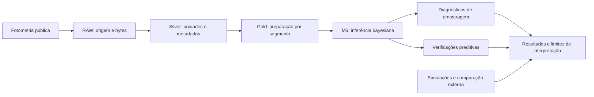

# Inferência bayesiana de trânsitos de exoplanetas

**Da curva de luz à evidência auditável.** Software de pesquisa do TCC de
Leonardo Moraes Barca, desenvolvido no MBA em Data Science e Analytics USP/Esalq.
O projeto integra modelagem física, inferência probabilística e engenharia de
dados para investigar **quando estimativas de trânsito e suas incertezas merecem confiança**.

[Guia do avaliador](docs/REVIEWER_GUIDE.md) ·
[Resultados e evidências](reports/publication_synthesis/tcc_evidence_v3/REPORT.md) ·
[Reprodução e disponibilidade](docs/REPRODUCIBILITY.md) ·
[Como citar](CITATION.cff) · [English](README.en.md)

## Comece por aqui

**Não é necessário instalar bibliotecas ou executar MCMC para examinar o trabalho.**
O [guia do avaliador](docs/REVIEWER_GUIDE.md) liga a pergunta científica ao modelo,
aos experimentos e aos arquivos que sustentam cada conclusão.

A referência científica desta apresentação é o commit
`127089538dbf2e233bce0d5e92c3977e115bb86b`, consolidado no
[índice canônico](publication/TCC_EVIDENCE_INDEX.json). A `main` reúne esse estado
maduro e a documentação pública; não substitui os resultados históricos por novos
ajustes. Relatórios selados continuam a retratar a data e o contrato em que foram produzidos.

## O que o projeto faz

| Frente | Implementação | Evidência disponível |
|---|---|---|
| Engenharia de dados | RAW → Silver → Gold; unidades, segmentos, exposição e identidade por conteúdo | Manifestos, hashes e verificações de preparação |
| Inferência física | Modelo M5 com escurecimento de bordo, exposição integrada e ruído branco heteroscedástico | Configurações, resumos posteriores e diagnósticos por execução |
| Avaliação experimental | Recuperação sintética, comparação com `juliet`, ablações e cinco sistemas reais | Coortes separadas, métricas, rejeições e limitações |
| Reprodutibilidade | Protocolos, sementes, tentativas, testes e preservação dos artefatos | Fontes numéricas, CI e recibos de restauração local |

**Aprovação computacional, adequação preditiva e identificação física são coisas
diferentes.** A análise preserva resultados favoráveis, rejeitados e inconclusivos.

## O que os experimentos mostraram

| Pergunta | Resultado | Limite da conclusão |
|---|---|---|
| O raio relativo foi recuperado? | Nos dois regimes sintéticos de curta exposição, o viés médio relativo foi pequeno, com intervalos conservadores | Resultado condicionado aos cenários e priors estudados |
| Os critérios bastaram em sinal fraco? | No regime menos informativo, os intervalos de 94% cobriram a escala orbital em **9/100** realizações e a duração em **48/100**, apesar de **85/100** aprovações conjuntas | Os critérios implementados não garantiram identificação de cada parâmetro |
| Outra implementação concordou? | Os três novos ajustes locais do benchmark passaram nos diagnósticos de amostragem e apresentaram marginais próximas às externas | Todos reprovaram no PPC temporal; concordância computacional não valida a hipótese física |
| O fluxo foi aplicado a outros sistemas? | Os cinco alvos pré-selecionados foram mantidos e avaliados | Houve limitações preditivas nos cinco; não se demonstrou validação populacional |

Fontes: [síntese v3](reports/publication_synthesis/tcc_evidence_v3/REPORT.md),
[métricas de recuperação](reports/publication_synthesis/tcc_evidence_v3/calibration_metrics.csv),
[comparações externas](reports/publication_synthesis/tcc_evidence_v3/benchmark_comparisons.csv)
e [revisão de calibração](docs/publication/CALIBRATION_REVIEW.md).

### Escala e unidade dos experimentos

| Campanha concluída | Unidades planejadas | Como interpretar |
|---|---:|---|
| `tcc_campaign_v1` | 117 | Inclui 80 realizações sintéticas, benchmark, ablações e cinco alvos |
| `tcc_calibration_confirmatory_v1` | 400 | Nova coorte: quatro regimes × 100 realizações, analisada separadamente |
| `tcc_numerical_complement_v4` | 24 | Ajustes pareados e repetições locais; **13** aprovações do sampler, **21** do PPC e **10** conjuntas |

São **541 unidades de trabalho e 542 tentativas preservadas**, não 541 conjuntos
independentes nem um único denominador de calibração. A campanha interrompida v3
é separada: sete diagnósticos preditivos foram invalidados por um defeito de
condicionamento, sem serem reclassificados como falhas físicas.
[Contagens por componente e população](reports/publication_synthesis/tcc_evidence_v3/gate_counts.csv).

## Modelo e alcance científico

O núcleo utiliza **Python, PyMC, ArviZ e exoplanet**. O M5 infere razão de raios,
geometria relativa, centro do trânsito, escurecimento de bordo e jitter branco,
com integração pelo tempo de exposição. Período e excentricidade são fixados;
propriedades estelares não são inferidas conjuntamente.

O modelo **não inclui GP nem covariância temporal**. A avaliação de cobertura com
verdades fixas não é SBC. A informação de catálogo no prior histórico impede
tratar a concordância com esse catálogo como validação independente.
[Metodologia](reports/publication_synthesis/tcc_evidence_v3/METHODOLOGY.md) ·
[Limitações](reports/publication_synthesis/tcc_evidence_v3/LIMITATIONS.md).

## Navegação técnica

| Diretório | Conteúdo |
|---|---|
| [`src/`](src/) e [`scripts/`](scripts/) | Implementações reutilizáveis e interfaces de execução |
| [`data/`](data/) | Camadas observacionais e manifestos |
| [`publication/`](publication/) | Protocolos, configurações de evidência e índice canônico |
| [`artifacts/publication_campaign/`](artifacts/publication_campaign/) | Resultados e tentativas por campanha |
| [`reports/publication_synthesis/tcc_evidence_v3/`](reports/publication_synthesis/tcc_evidence_v3/) | Síntese atual, tabelas, fontes e afirmações |
| [`tests/`](tests/) e [CI](.github/workflows/ci.yml) | Testes determinísticos, pequenos testes científicos e contratos |

Para instalar o ambiente, verificar os bytes ou reproduzir a análise, siga
[Reprodução e disponibilidade](docs/REPRODUCIBILITY.md). Os exemplos diferenciam
leitura, verificação, restauração e nova inferência. **Não execute um lote final
nem reutilize `scientific_003` apenas para conhecer o repositório.**

## Código público, citação e preservação

O código e os artefatos versionados estão acessíveis neste repositório público.
Traces completos e certos intermediários volumosos ainda dependem de um pacote
externo local; a visibilidade do GitHub não significa que esse pacote esteja publicado.
Não há DOI atribuído nem alegação de artigo aceito. Use [CITATION.cff](CITATION.cff)
e informe o commit efetivamente consultado.

Código autoral sob [MIT](LICENSE). Dados e materiais de terceiros conservam seus
termos próprios; a menção ao MBA identifica o contexto acadêmico, não endosso
institucional do software. [Contribuições](CONTRIBUTING.md) ·
[Segurança e privacidade](SECURITY.md).
