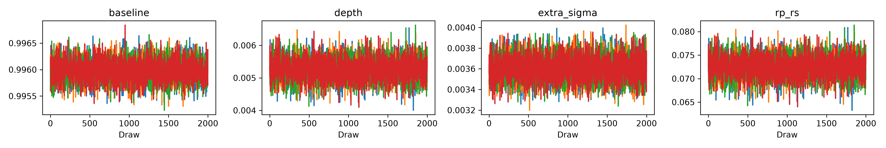
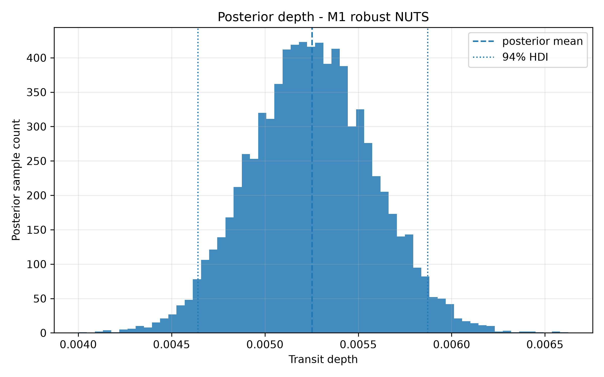
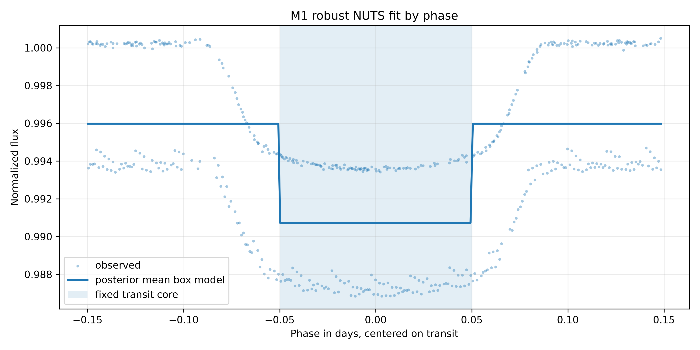
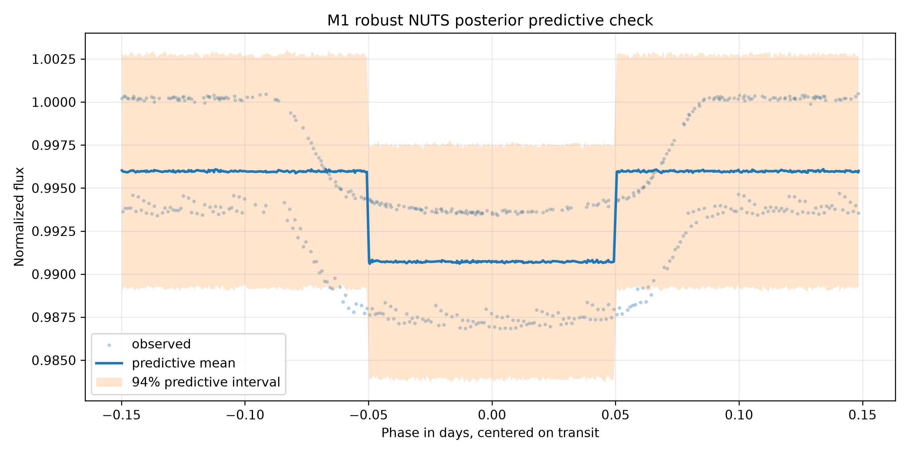

# 44 - Reexecução Robusta NUTS do M1

## 1. Papel Desta Subetapa

Esta documentação registra a reexecução robusta do mesmo modelo M1:

```text
M1 - Bayesian Baseline Box Transit
```

Ela não cria um novo modelo. A especificação probabilística, a entrada Gold e
as regras de pré-processamento permanecem as mesmas. A mudança relevante é
operacional e inferencial:

- a execução curta anterior foi preservada como `001_operational_metropolis`;
- a nova execução robusta foi criada como `002_nuts_robust`;
- a execução robusta usa NUTS com `2000` draws, `2000` tune e `4` cadeias;
- a execução robusta é a recomendada para interpretação do M1 como baseline.

## 2. Motivação

A primeira execução validada do M1 foi útil para testar a cadeia completa de
artefatos, mas não era cientificamente interpretável.

O ambiente anterior não tinha `Python.h`, o que impediu o backend C do
PyTensor. Por isso, o pipeline foi validado com Metropolis curto:

```text
sampler = Metropolis
draws = 300
tune = 300
chains = 4
```

Diagnósticos da execução curta:

```text
max R-hat = 2,33522345
min ESS = 4,25512801
```

Esses valores indicavam ausência de convergência adequada.

## 3. Ambiente Robusto Criado

Foi criado um ambiente local separado:

```text
.venv-nuts/
```

Esse ambiente foi construído a partir do Python do Conda, que possui headers de
desenvolvimento disponíveis.

Resumo do ambiente usado:

```text
Python = 3.13.13
Python executable = .venv-nuts/bin/python
Python.h disponível = True
PyMC = 6.0.1
ArviZ = 1.2.0
PyTensor = 3.0.7
PyTensor flags = base_compiledir=/tmp/pytensor-cache-nuts-robust
```

O backend C do PyTensor foi testado com uma amostragem NUTS mínima antes da
execução robusta. O teste funcionou sem forçar `linker=py`.

## 4. Comando de Execução

Script criado:

```text
scripts/run_bayesian_baseline_nuts_robust.py
```

Comando usado:

```bash
.venv-nuts/bin/python scripts/run_bayesian_baseline_nuts_robust.py
```

Esse script:

- preserva os artefatos planos antigos em `runs/001_operational_metropolis`;
- executa o M1 com NUTS;
- salva a nova execução em `runs/002_nuts_robust`;
- gera posterior predictive;
- salva tabelas, figuras, trace, configuração e relatório;
- cria comparação direta entre as duas execuções.

## 5. Entrada e Pré-processamento Mantidos

Entrada principal:

```text
data/gold/hat_p_7_b/modeling/transit_window_lightcurve.csv
```

Regras preservadas:

```text
abs(phase) <= 0,15
quality == 0
flux não ausente
flux_err não ausente
flux_err > 0
```

Normalização local:

```text
baseline region = 0,08 <= abs(phase) <= 0,15
baseline_median = 1040715,45
normalized_flux = flux / baseline_median
normalized_flux_err = flux_err / baseline_median
```

Região central fixa do trânsito no M1:

```text
abs(phase) <= 0,05
```

Resumo da entrada robusta:

| Métrica | Valor |
|---|---:|
| Linhas na janela Gold original | `1664` |
| Linhas após `abs(phase) <= 0,15` | `516` |
| Linhas após `quality == 0` | `516` |
| Linhas usadas no modelo | `516` |
| Pontos na região de baseline | `232` |
| Pontos no núcleo do trânsito | `179` |

## 6. Modelo Probabilístico Mantido

O M1 continua sendo um modelo box-shaped:

```text
mu_i = baseline - depth, se abs(phase_i) <= 0,05
mu_i = baseline, caso contrário
```

Priors:

```text
baseline ~ Normal(1.0, 0.01)
depth ~ HalfNormal(0.02)
extra_sigma ~ HalfNormal(0.005)
```

Likelihood:

```text
sigma_eff_i = sqrt(normalized_flux_err_i^2 + extra_sigma^2)
normalized_flux_i ~ Normal(mu_i, sigma_eff_i)
```

Parâmetro derivado:

```text
rp_rs = sqrt(depth)
```

## 7. Configuração NUTS

Configuração usada:

```text
sampler = NUTS
draws = 2000
tune = 2000
chains = 4
cores = 4
target_accept = 0,9
random_seed = 42
```

Não houve necessidade de repetir com `target_accept = 0,95`, porque a execução
com `0,9` terminou com zero divergências.

Durante a adaptação, o stdout registrou um `RuntimeWarning` de overflow em
`quadpotential.py`. Esse aviso não foi ocultado. A avaliação final foi feita
pelos diagnósticos MCMC salvos, que ficaram adequados para o baseline M1:

```text
divergences = 0
max R-hat = 1,00088086
min ESS = 4553,60020940
BFMI mínimo = 1,10526248
```

## 8. Resultados Posteriores Robustos

Arquivo:

```text
tables/bayesian_baseline/hat_p_7_b/runs/002_nuts_robust/posterior_summary.csv
```

Resumo:

| Parâmetro | Média | HDI 3% | HDI 97% | R-hat | ESS bulk | ESS tail |
|---|---:|---:|---:|---:|---:|---:|
| `baseline` | `0,99597938` | `0,99561513` | `0,99636166` | `1,00044605` | `4613,18299016` | `5213,13706106` |
| `depth` | `0,00525258` | `0,00464576` | `0,00587726` | `1,00034161` | `4553,60020940` | `4599,27286730` |
| `extra_sigma` | `0,00360075` | `0,00339170` | `0,00382274` | `1,00088086` | `6017,13283284` | `5859,49044795` |
| `rp_rs` | `0,07243869` | `0,06815983` | `0,07666328` | `1,00033967` | `4553,60020940` | `4599,27286730` |

Parâmetros derivados:

```text
depth_mean = 0,00525258
depth_hdi_3 = 0,00464576
depth_hdi_97 = 0,00587726
rp_rs_mean = 0,07243869
rp_rs_hdi_3 = 0,06815983
rp_rs_hdi_97 = 0,07666328
```

## 9. Comparação Entre Execuções

Arquivo:

```text
tables/bayesian_baseline/hat_p_7_b/model_run_comparison.csv
```

Comparação essencial:

| Run | Sampler | Draws | Tune | R-hat máximo | ESS mínimo | Divergências | Recomendado |
|---|---|---:|---:|---:|---:|---:|---|
| `001_operational_metropolis` | `Metropolis` | `300` | `300` | `2,33522345` | `4,25512801` | não aplicável | `False` |
| `002_nuts_robust` | `NUTS` | `2000` | `2000` | `1,00088086` | `4553,60020940` | `0` | `True` |

Conclusão:

```text
002_nuts_robust substitui 001_operational_metropolis para interpretação do M1.
```

A execução Metropolis curta permanece preservada apenas para rastreabilidade e
histórico operacional.

## 10. Artefatos Criados

Modelos:

```text
models/bayesian_baseline/hat_p_7_b/runs/001_operational_metropolis/
models/bayesian_baseline/hat_p_7_b/runs/002_nuts_robust/
```

Tabelas:

```text
tables/bayesian_baseline/hat_p_7_b/runs/001_operational_metropolis/
tables/bayesian_baseline/hat_p_7_b/runs/002_nuts_robust/
tables/bayesian_baseline/hat_p_7_b/model_run_comparison.csv
```

Figuras:

```text
figures/bayesian_baseline/hat_p_7_b/runs/001_operational_metropolis/
figures/bayesian_baseline/hat_p_7_b/runs/002_nuts_robust/
```

Relatório:

```text
reports/bayesian_baseline_hat_p_7_b_nuts_robust_report.md
```

## 11. Figuras Principais

Trace plot robusto:



Posterior robusta de `depth`:



Ajuste box por fase:



Posterior predictive check:



## 12. Integridade das Camadas de Dados

Antes e depois da execução robusta, foi calculada uma impressão digital dos
arquivos em:

```text
data/raw/
data/silver/
data/gold/
```

Resultado:

```text
arquivos antes = 446
arquivos depois = 446
arquivos adicionados = 0
arquivos ausentes = 0
checksums alterados = 0
timestamps alterados = 0
```

Portanto, a reexecução robusta não modificou RAW, Silver ou Gold.

## 13. Interpretação Metodológica

Agora o M1 pode ser descrito como um baseline bayesiano efetivamente amostrado
com NUTS e diagnósticos adequados.

O resultado principal a reportar para o M1 é:

```text
depth = 0,00525258, HDI 94% [0,00464576, 0,00587726]
Rp/Rs = 0,07243869, HDI 94% [0,06815983, 0,07666328]
```

Ainda assim, essa interpretação deve ser limitada ao escopo do M1. O modelo:

- usa caixa fixa;
- não modela limb darkening;
- não modela ingresso e egresso;
- não estima duração;
- não incorpora geometria orbital completa;
- não é caracterização física final do planeta.

## 14. Próximo Passo

O próximo passo recomendado é usar `002_nuts_robust` como baseline comparativo
para o M2.

O M2 deve melhorar a capacidade preditiva da curva em função da fase, mantendo
a rastreabilidade dos dados Gold e permitindo comparação posterior com o M1 por
posterior predictive checks e métricas adequadas.
