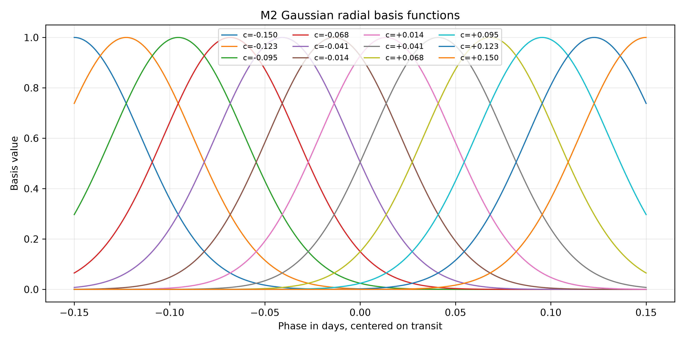

# 02 - Especificação do Modelo M2

## 1. Script

Arquivo:

```text
scripts/run_bayesian_predictive_phase_regression.py
```

Comando validado:

```bash
.venv-nuts/bin/python scripts/run_bayesian_predictive_phase_regression.py
```

O ambiente `.venv-nuts` foi usado porque já havia sido validado na execução
robusta do M1 com backend adequado para NUTS.

## 2. Notebook

Arquivo:

```text
notebooks/04_bayesian_predictive_phase_regression_hat_p_7_b.ipynb
```

O notebook é reprodutível e chama o script principal para gerar os mesmos
artefatos.

## 3. Entrada

Arquivo Gold:

```text
data/gold/hat_p_7_b/modeling/transit_window_lightcurve.csv
```

Essa entrada não foi modificada.

## 4. Pré-processamento

Regras aplicadas:

```text
abs(phase) <= 0,15
quality == 0
phase não ausente
flux não ausente
flux_err não ausente
flux_err > 0
```

Resumo:

| Métrica | Valor |
|---|---:|
| Linhas na janela Gold original | `1664` |
| Linhas após filtro de fase | `516` |
| Linhas após filtro de qualidade | `516` |
| Linhas usadas no M2 | `516` |

## 5. Normalização

A normalização foi mantida igual à do M1 para comparabilidade.

Região de baseline:

```text
0,08 <= abs(phase) <= 0,15
```

Mediana usada:

```text
baseline_median = 1040715,45
```

Transformações:

```text
normalized_flux = flux / baseline_median
normalized_flux_err = flux_err / baseline_median
```

Arquivo gerado:

```text
tables/bayesian_predictive_phase_regression/hat_p_7_b/modeling_input_predictive.csv
```

## 6. Funções de Base Radial

M2 usa funções de base radial gaussianas fixas, não Gaussian Process.

Para cada centro `c_k`:

```text
phi_k(x) = exp(-0.5 * ((x - c_k) / width)^2)
```

Configuração:

```text
n_basis = 12
basis_width = 0,035
centers = linspace(-0,15, 0,15, 12)
```

Arquivo com o grid e valores das bases:

```text
tables/bayesian_predictive_phase_regression/hat_p_7_b/prediction_grid.csv
```

Figura:



## 7. Função Latente

A função latente é:

```text
f(x) = intercept + soma_k w_k * phi_k(x)
```

onde:

- `x` é a fase orbital;
- `phi_k(x)` é a k-ésima função radial;
- `w_k` é o peso correspondente;
- `intercept` representa o nível médio global em escala normalizada.

## 8. Priors

Priors usados:

```text
intercept ~ Normal(1.0, 0.01)
weight_sigma ~ HalfNormal(0.01)
weights_raw_k ~ Normal(0, 1)
weights_k = weights_raw_k * weight_sigma
extra_sigma ~ HalfNormal(0.005)
```

Foi usada parametrização não centrada para os pesos:

```text
weights = weights_raw * weight_sigma
```

Essa escolha reduz problemas geométricos típicos de modelos hierárquicos.

## 9. Likelihood

Para cada ponto observado:

```text
sigma_eff_i = sqrt(normalized_flux_err_i^2 + extra_sigma^2)
normalized_flux_i ~ Normal(f(phase_i), sigma_eff_i)
```

O termo `extra_sigma` captura dispersão adicional não explicada pelo erro
observacional tabulado.

## 10. Grid Preditivo

Grid:

```text
phase_grid = linspace(-0,15, 0,15, 300)
```

Para cada amostra posterior foi calculada a função latente nesse grid.

Arquivo:

```text
tables/bayesian_predictive_phase_regression/hat_p_7_b/predictive_curve_summary.csv
```

Campos:

```text
phase
latent_mean
latent_hdi_3
latent_hdi_97
predictive_mean
predictive_hdi_3
predictive_hdi_97
```

## 11. Profundidade Exploratória Derivada

M2 não estima `depth` como parâmetro primário.

Para comparação qualitativa com M1, foi derivada uma profundidade exploratória:

```text
predicted_depth = baseline_level - min(f_grid)
```

com:

```text
baseline_level = média de f_grid nas bordas, abs(phase) >= 0,08
```

Esse valor deve ser tratado apenas como diagnóstico preditivo. Ele não é
equivalente físico direto ao `depth` paramétrico do M1.

## 12. Amostragem

Configuração inicial:

```text
draws = 2000
tune = 2000
chains = 4
target_accept = 0,9
random_seed = 42
```

Tentativas:

```text
target_accept = 0,90 -> 21 divergências
target_accept = 0,95 -> 3 divergências
target_accept = 0,99 -> 0 divergências
```

A execução final registrada usa:

```text
target_accept = 0,99
```

## 13. Saídas

Modelo:

```text
models/bayesian_predictive_phase_regression/hat_p_7_b/runs/001_nuts/
```

Tabelas:

```text
tables/bayesian_predictive_phase_regression/hat_p_7_b/
```

Figuras:

```text
figures/bayesian_predictive_phase_regression/hat_p_7_b/
```

Relatório:

```text
reports/bayesian_predictive_phase_regression_hat_p_7_b_report.md
```
