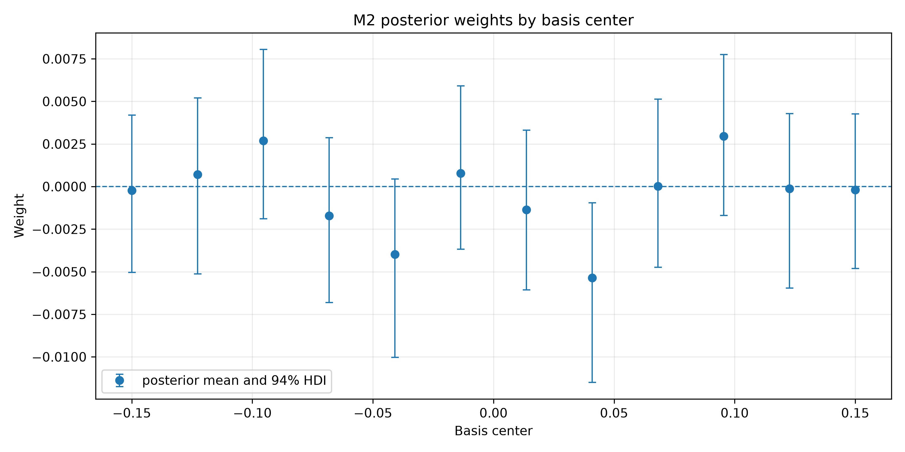
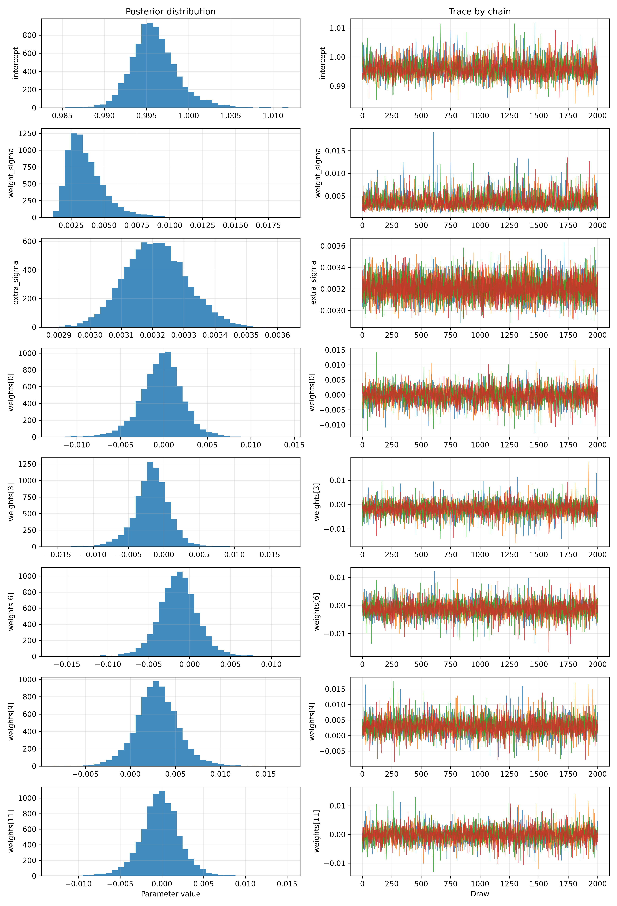
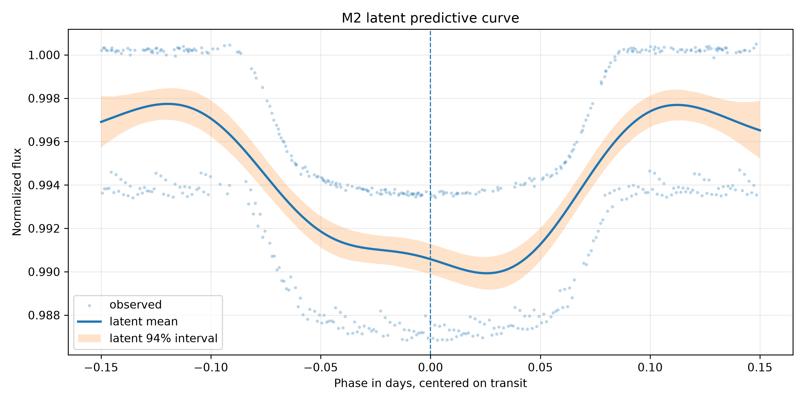
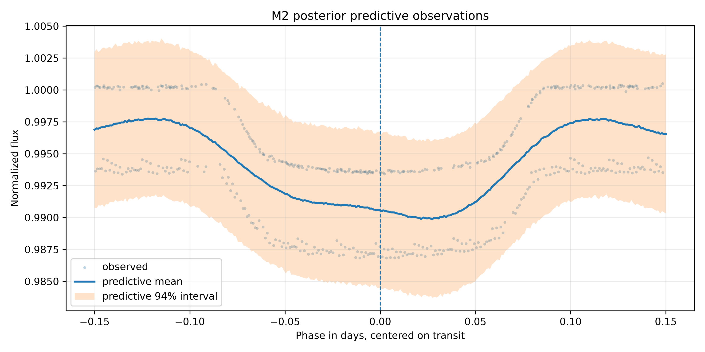
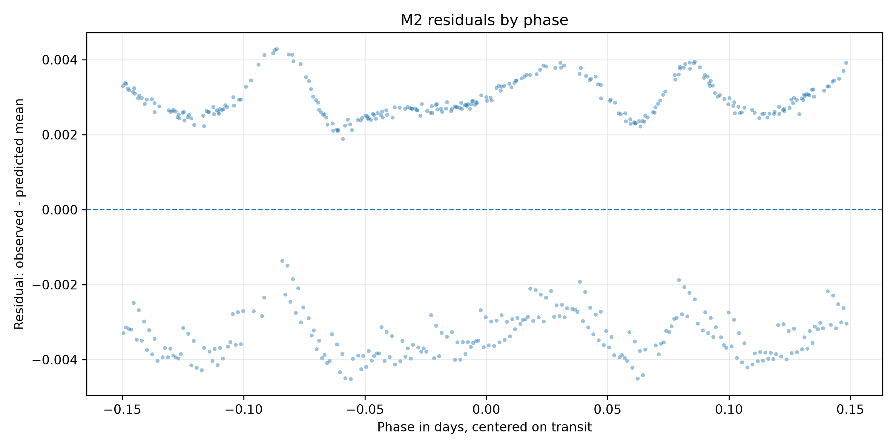
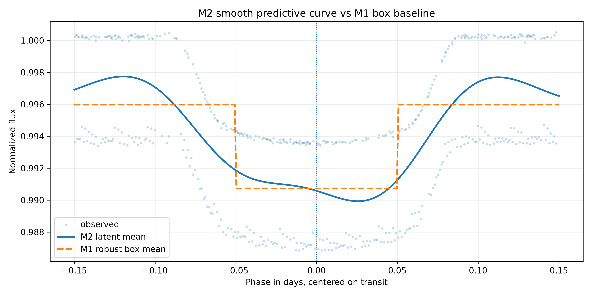

# 03 - Resultados e Diagnósticos do M2

## 1. Artefatos de Resultado

Resumo inferencial:

```text
models/bayesian_predictive_phase_regression/hat_p_7_b/runs/001_nuts/inference_data_summary.json
```

Configuração:

```text
models/bayesian_predictive_phase_regression/hat_p_7_b/runs/001_nuts/model_config.json
```

Trace:

```text
models/bayesian_predictive_phase_regression/hat_p_7_b/runs/001_nuts/trace.nc
```

## 2. Diagnósticos MCMC

Resultado final após `target_accept = 0,99`:

| Métrica | Valor |
|---|---:|
| Pontos usados | `516` |
| Draws | `2000` |
| Tune | `2000` |
| Chains | `4` |
| R-hat máximo | `1,00292448` |
| ESS mínimo | `2269,80467052` |
| Divergências | `0` |
| Aceitação média | `0,98810751` |
| BFMI mínimo | `0,71467278` |

Conclusão:

```text
Os diagnósticos satisfazem os critérios definidos para uso do M2 como modelo preditivo intermediário.
```

## 3. Parâmetros Principais

Arquivo:

```text
tables/bayesian_predictive_phase_regression/hat_p_7_b/posterior_summary.csv
```

Resumo:

| Parâmetro | Média | HDI 3% | HDI 97% | R-hat |
|---|---:|---:|---:|---:|
| `intercept` | `0,99596322` | `0,99131842` | `1,00207021` | `1,00256981` |
| `weight_sigma` | `0,00367651` | `0,00179424` | `0,00716827` | `1,00292448` |
| `extra_sigma` | `0,00321035` | `0,00303038` | `0,00340200` | `1,00093715` |

Os pesos `weights[k]` estão documentados linha a linha no arquivo CSV, junto
com o índice e o centro da função de base radial.

Figura dos pesos:



## 4. Trace Plot

Figura:



O trace plot inclui:

- `intercept`;
- `weight_sigma`;
- `extra_sigma`;
- pesos selecionados.

## 5. Curva Latente

Arquivo:

```text
tables/bayesian_predictive_phase_regression/hat_p_7_b/predictive_curve_summary.csv
```

Figura:



Leitura:

- a média da função latente acompanha a depressão do trânsito;
- o intervalo da função latente é mais estreito que o intervalo preditivo de
  observações futuras;
- a curva é mais suave e flexível que o box model do M1.

## 6. Posterior Predictive

Figura:



Cobertura aproximada do intervalo preditivo de 94% nos pontos observados:

```text
1,000000
```

Essa cobertura alta indica que o intervalo preditivo cobre os dados, mas
também sugere que o termo `extra_sigma` domina a largura preditiva. Isso deve
ser considerado na comparação futura entre modelos.

## 7. Resíduos

Arquivo:

```text
tables/bayesian_predictive_phase_regression/hat_p_7_b/residual_summary.csv
```

Métricas:

| Métrica | Valor |
|---|---:|
| Média dos resíduos | `-0,00000214` |
| Mediana dos resíduos | `0,00234046` |
| Desvio padrão dos resíduos | `0,00318197` |
| Média dos resíduos padronizados | `-0,00066448` |
| Desvio padrão dos resíduos padronizados | `0,99112818` |

Figura:



## 8. Profundidade Exploratória Derivada

M2 não possui `depth` como parâmetro primário.

Foi derivado apenas para diagnóstico:

```text
predicted_depth = baseline_level - min(f_grid)
```

Resultado:

| Métrica | Valor |
|---|---:|
| `predicted_depth_mean` | `0,00721029` |
| `predicted_depth_hdi_3` | `0,00637213` |
| `predicted_depth_hdi_97` | `0,00809741` |
| `baseline_level_mean` | `0,99709191` |
| `min_latent_flux_mean` | `0,98988161` |
| mediana da fase de mínimo | `0,02558528` |

Interpretação:

```text
Esse valor é exploratório e não deve ser tratado como equivalente físico direto ao depth do M1.
```

## 9. Comparação Qualitativa com M1

M1 robusto:

```text
depth_mean = 0,00525258
```

M2:

```text
predicted_depth_mean = 0,00721029
```

Diferença:

```text
M2 - M1 = 0,00195771
```

Figura:



Leitura:

- M1 representa o trânsito por uma caixa fixa;
- M2 permite uma curva suave;
- M2 parece descrever melhor a forma visual do trânsito;
- a comparação de profundidades é apenas qualitativa porque as definições são
  diferentes.

## 10. Respostas Diretas

A curva preditiva recupera visualmente o trânsito?

```text
Sim. A depressão próxima da fase zero aparece na curva latente média.
```

O intervalo preditivo cobre razoavelmente os dados?

```text
Sim. A cobertura aproximada do intervalo preditivo de 94% nos pontos observados foi 1,0.
```

A profundidade exploratória do M2 é próxima da depth do M1?

```text
Está na mesma ordem de grandeza, mas é maior. A diferença é esperada porque M2 usa mínimo da curva suave, não uma caixa fixa.
```

O M2 melhora a descrição visual do formato do trânsito em relação ao box model?

```text
Sim, qualitativamente, por permitir uma transição suave em fase.
```

O M2 deve ser usado como modelo físico final?

```text
Não.
```
