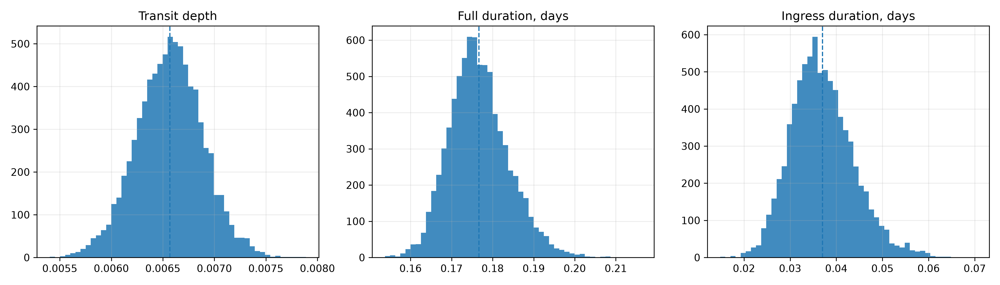
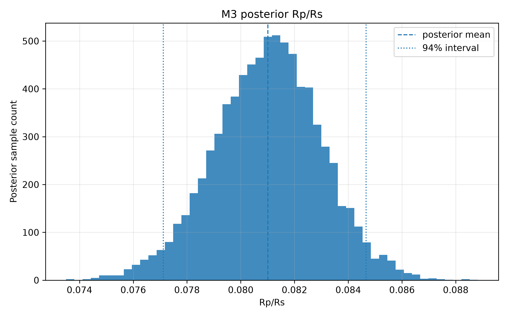
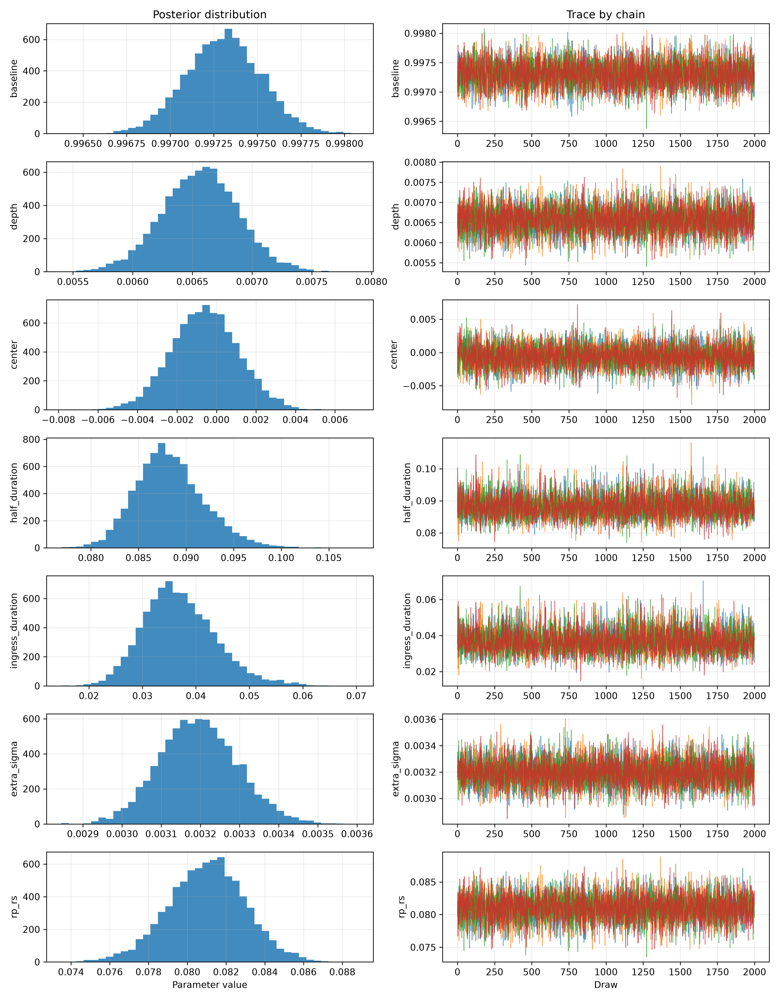
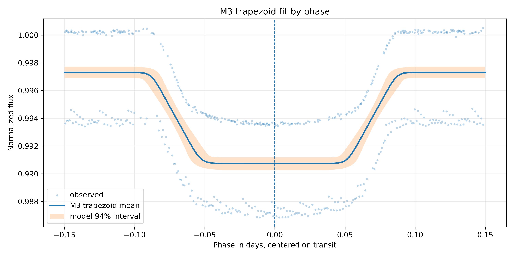

# 03 - Resultados e Diagnósticos do M3

## 1. Artefatos de Resultado

Resumo inferencial:

```text
models/bayesian_trapezoid_transit/hat_p_7_b/runs/001_nuts/inference_data_summary.json
```

Configuração:

```text
models/bayesian_trapezoid_transit/hat_p_7_b/runs/001_nuts/model_config.json
```

Trace:

```text
models/bayesian_trapezoid_transit/hat_p_7_b/runs/001_nuts/trace.nc
```

## 2. Diagnósticos MCMC

Resultado final:

| Métrica | Valor |
|---|---:|
| Pontos usados | `516` |
| Draws | `2000` |
| Tune | `2000` |
| Chains | `4` |
| `target_accept` final | `0,90` |
| R-hat máximo | `1,00107423` |
| ESS mínimo | `4212,34208408` |
| Divergências | `0` |
| Aceitação média | `0,90800918` |
| BFMI mínimo | `0,85430120` |

Conclusão:

```text
Os diagnósticos satisfazem os critérios definidos para interpretar o M3 como
modelo trapezoidal aproximado.
```

## 3. Parâmetros Principais

Arquivo:

```text
tables/bayesian_trapezoid_transit/hat_p_7_b/posterior_summary.csv
```

Resumo:

| Parâmetro | Média | HDI 3% | HDI 97% | R-hat | ESS bulk | ESS tail |
|---|---:|---:|---:|---:|---:|---:|
| `baseline` | `0,99730624` | `0,99690219` | `0,99771396` | `1,00098607` | `5725,46753276` | `5562,56225124` |
| `depth` | `0,00656620` | `0,00594692` | `0,00716767` | `1,00038945` | `5995,33013887` | `5614,30368942` |
| `center` | `-0,00058156` | `-0,00373031` | `0,00260803` | `1,00011232` | `6882,63367449` | `5538,93234534` |
| `half_duration` | `0,08832370` | `0,08218581` | `0,09584455` | `1,00080861` | `4830,81184246` | `4260,83957835` |
| `ingress_duration` | `0,03697592` | `0,02548890` | `0,05114678` | `1,00107423` | `4560,39444976` | `4212,34208408` |
| `extra_sigma` | `0,00319567` | `0,00301355` | `0,00338942` | `1,00006640` | `7350,45288943` | `5260,39266575` |
| `rp_rs` | `0,08100761` | `0,07711627` | `0,08466210` | `1,00042132` | `5995,33013887` | `5614,30368942` |

## 4. Parâmetros Derivados

Arquivo:

```text
tables/bayesian_trapezoid_transit/hat_p_7_b/derived_parameters_summary.csv
```

Principais resultados:

| Parâmetro derivado | Média | HDI 3% | HDI 97% |
|---|---:|---:|---:|
| `depth` | `0,00656620` | `0,00594692` | `0,00716767` |
| `Rp/Rs` | `0,08100761` | `0,07711627` | `0,08466210` |
| `center` dias | `-0,00058156` | `-0,00373031` | `0,00260803` |
| duração total dias | `0,17664741` | `0,16437161` | `0,19168911` |
| duração total horas | `4,23954` | - | - |
| ingresso dias | `0,03697592` | - | - |
| ingresso horas | `0,88742` | - | - |
| fundo plano dias | `0,10269557` | - | - |
| ingresso+egresso dias | `0,07395184` | - | - |

Figura de posteriores de profundidade e duração:



Figura de `Rp/Rs`:



## 5. Trace Plot

Figura:



O trace plot inclui:

- `baseline`;
- `depth`;
- `center`;
- `half_duration`;
- `ingress_duration`;
- `extra_sigma`;
- `rp_rs`.

## 6. Curva Trapezoidal Ajustada

Arquivo:

```text
tables/bayesian_trapezoid_transit/hat_p_7_b/trapezoid_curve_summary.csv
```

Figura:



Leitura:

- a curva média representa a depressão do trânsito com transições lineares;
- o centro posterior fica próximo de zero;
- a forma é mais flexível que a caixa do M1;
- a forma é mais parametricamente interpretável que a curva suave do M2.

## 7. Posterior Predictive

Arquivo:

```text
tables/bayesian_trapezoid_transit/hat_p_7_b/posterior_predictive_summary.csv
```

Figura:


Cobertura aproximada do intervalo preditivo de 94% nos pontos observados:

```text
1,000000
```

Essa cobertura indica que o intervalo preditivo cobre os dados observados. Como
em M2, a largura preditiva deve ser interpretada junto com `extra_sigma`, pois
o ruído extra ajuda a absorver dispersão não capturada pela forma média.

## 8. Resíduos

Arquivo:

```text
tables/bayesian_trapezoid_transit/hat_p_7_b/residual_summary.csv
```

Métricas:

| Métrica | Valor |
|---|---:|
| Média dos resíduos | `-0,00000396` |
| Mediana dos resíduos | `0,00259044` |
| Desvio padrão dos resíduos | `0,00317806` |
| Média dos resíduos padronizados | `-0,00123703` |
| Desvio padrão dos resíduos padronizados | `0,99446006` |

Figura:


## 9. Comparação Qualitativa com M1 e M2

M1 robusto:

```text
depth_mean = 0,00525258
Rp/Rs mean = 0,07243869
```

M2:

```text
predicted_depth exploratório = 0,00721029
```

M3:

```text
depth_mean = 0,00656620
Rp/Rs mean = 0,08100761
```

Figura:


Leitura:

- M1 é mais rígido e tende a representar o trânsito por uma caixa fixa.
- M2 é mais flexível e segue uma curva suave, mas sua profundidade é derivada
  de forma exploratória.
- M3 fica entre os dois: estima parâmetros interpretáveis e permite
  ingresso/egresso.
- A profundidade M3 ficou entre a profundidade paramétrica do M1 e a
  profundidade exploratória do M2.

## 10. Respostas Diretas

O modelo convergiu?

```text
Sim. Os diagnósticos de NUTS foram adequados para a interpretação do M3.
```

Houve divergências?

```text
Não. Divergências = 0.
```

Qual foi a profundidade posterior?

```text
depth_mean = 0,00656620, HDI 94% [0,00594692, 0,00716767].
```

Qual foi `Rp/Rs` posterior?

```text
Rp/Rs mean = 0,08100761, HDI 94% [0,07711627, 0,08466210].
```

Qual foi a duração total aproximada?

```text
full_duration_mean = 0,17664741 dias, aproximadamente 4,23954 horas.
```

Qual foi o centro posterior do trânsito?

```text
center_mean = -0,00058156 dias, com HDI 94% [-0,00373031, 0,00260803].
```

O M3 descreve melhor o formato do trânsito que o box M1?

```text
Qualitativamente sim, porque inclui ingresso e egresso.
```

O M3 é mais interpretável que o M2?

```text
Sim, porque possui parâmetros explícitos de profundidade, centro e duração.
```

O M3 deve ser tratado como modelo físico final?

```text
Não. Ele ainda é uma aproximação paramétrica simplificada.
```
