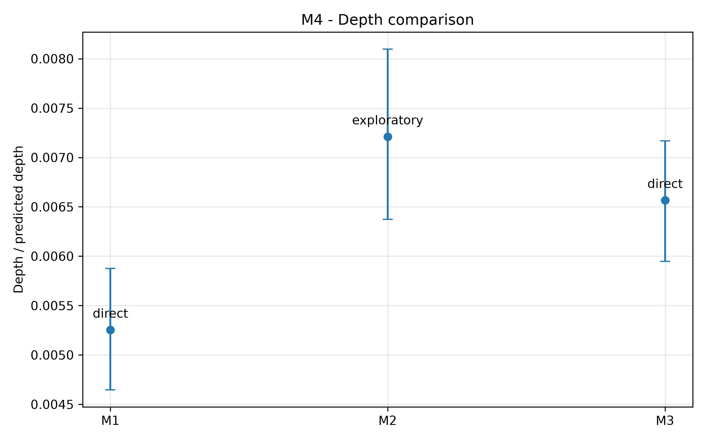
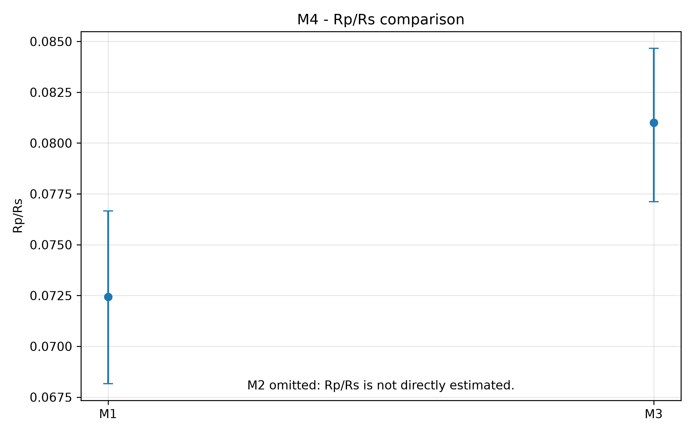
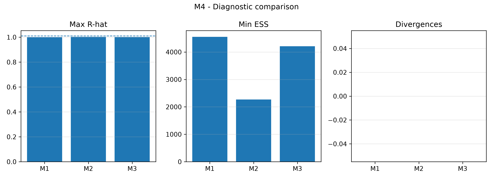
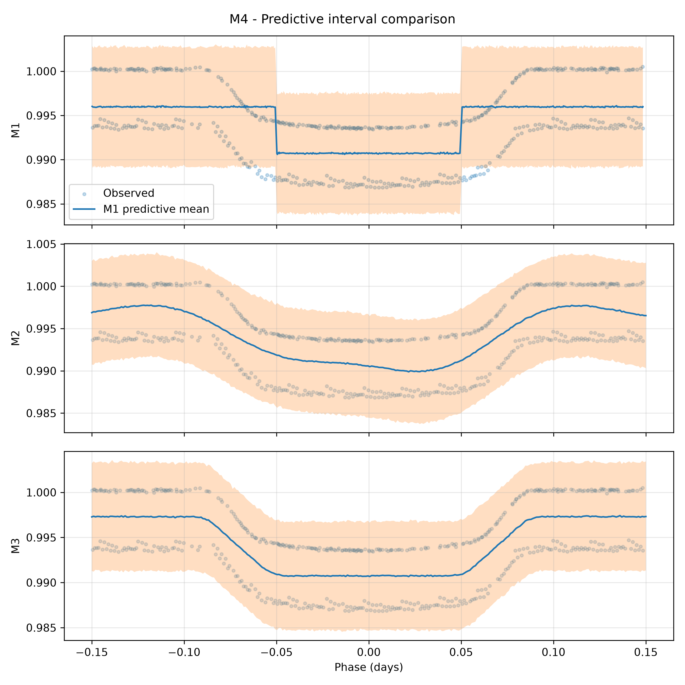
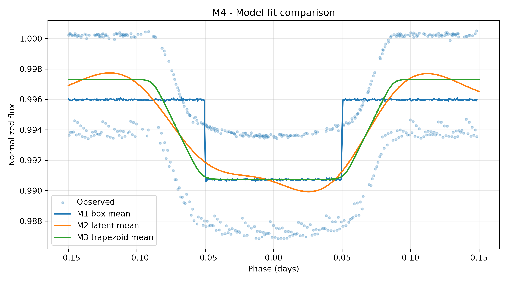
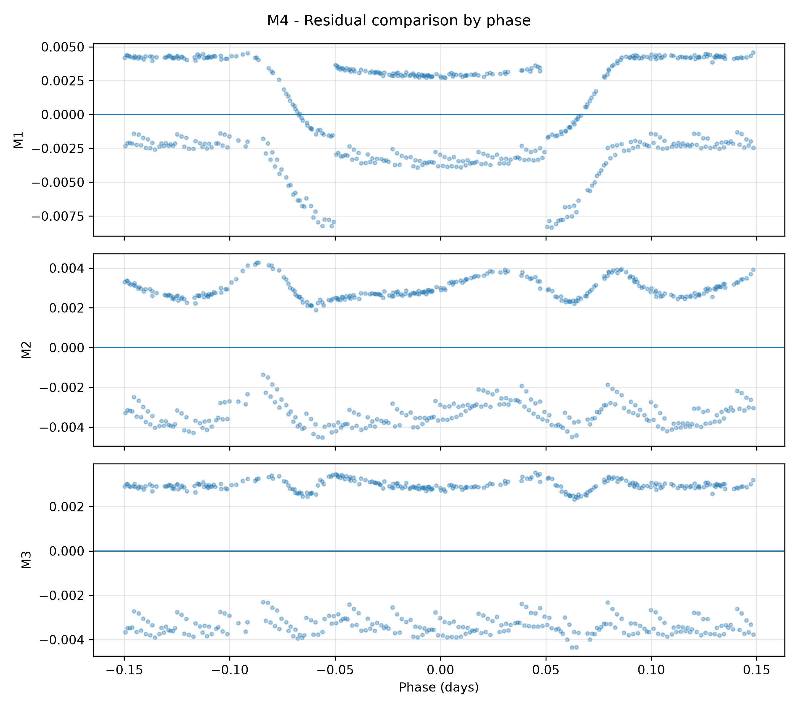
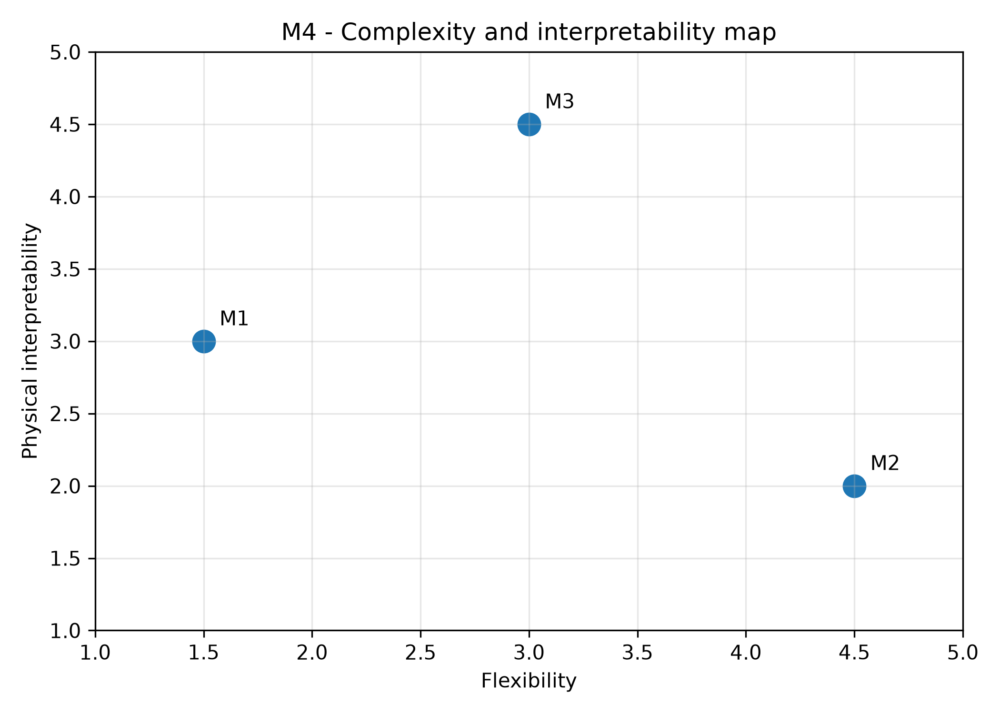

# 03 - Resultados Comparativos do M4

## 1. Profundidade

Arquivo:

```text
tables/model_comparison/hat_p_7_b/parameter_comparison.csv
```

| Modelo | Tipo | Profundidade média | HDI 3% | HDI 97% |
|---|---|---:|---:|---:|
| M1 | direta | `0,00525258` | `0,00464576` | `0,00587726` |
| M2 | exploratória | `0,00721029` | `0,00637213` | `0,00809741` |
| M3 | direta aproximada | `0,00656620` | `0,00594692` | `0,00716767` |

Figura:



Leitura:

- M1 produz a menor profundidade, consistente com a rigidez do box model.
- M2 produz a maior profundidade, mas ela é exploratória e derivada da curva
  suave.
- M3 fica entre M1 e M2, com profundidade direta dentro de um modelo
  trapezoidal.

## 2. Rp/Rs

| Modelo | Rp/Rs médio | HDI 3% | HDI 97% |
|---|---:|---:|---:|
| M1 | `0,07243869` | `0,06815983` | `0,07666328` |
| M2 | não estimado diretamente | - | - |
| M3 | `0,08100761` | `0,07711627` | `0,08466210` |

Figura:



Leitura:

M2 não aparece como estimativa física de `Rp/Rs`, porque seu
`predicted_depth` não é parâmetro direto do modelo.

## 3. Diagnósticos MCMC

Arquivo:

```text
tables/model_comparison/hat_p_7_b/diagnostic_comparison.csv
```

| Modelo | R-hat máximo | ESS mínimo | Divergências | Status |
|---|---:|---:|---:|---|
| M1 | `1,00088086` | `4553,60020940` | `0` | `good` |
| M2 | `1,00292448` | `2269,80467052` | `0` | `good` |
| M3 | `1,00107423` | `4212,34208408` | `0` | `good` |

Figura:



Leitura:

Todos os modelos tiveram diagnósticos adequados pelos critérios definidos. M1
tem o menor R-hat máximo; M3 tem ESS mínimo alto e divergências zero; M2 exigiu
`target_accept = 0,99`, mas a execução final também ficou adequada.

## 4. Métricas Preditivas

Arquivo:

```text
tables/model_comparison/hat_p_7_b/predictive_metric_comparison.csv
```

| Modelo | RMSE | MAE | Cobertura 94% |
|---|---:|---:|---:|
| M1 | `0,00358754` | `0,00327957` | `0,961240` |
| M2 | `0,00317888` | `0,00312563` | `1,000000` |
| M3 | `0,00317499` | `0,00315311` | `1,000000` |

Figura:



Leitura:

M2 e M3 ficam praticamente empatados em RMSE, com pequena vantagem numérica
para M3. M1 tem erro maior, o que é esperado pela forma box-shaped fixa.

## 5. Ajustes Visuais

Figura:



Leitura:

- M1 é útil como referência simples.
- M2 acompanha suavemente a depressão observada.
- M3 adiciona estrutura de ingresso e egresso sem abrir mão de parâmetros
  interpretáveis.

## 6. Resíduos

Arquivo:

```text
tables/model_comparison/hat_p_7_b/residual_comparison.csv
```

Figura:



Leitura:

Os resíduos são comparáveis em escala entre os modelos. M1 mostra o efeito da
forma rígida; M2 e M3 reduzem a diferença média entre forma esperada e pontos
observados.

## 7. Mapa Conceitual

Figura:



Leitura:

- M1: baixa flexibilidade, interpretabilidade moderada.
- M2: alta flexibilidade, menor interpretabilidade física direta.
- M3: flexibilidade intermediária e maior interpretabilidade física aproximada.
