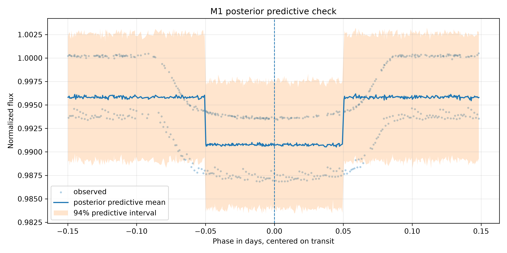
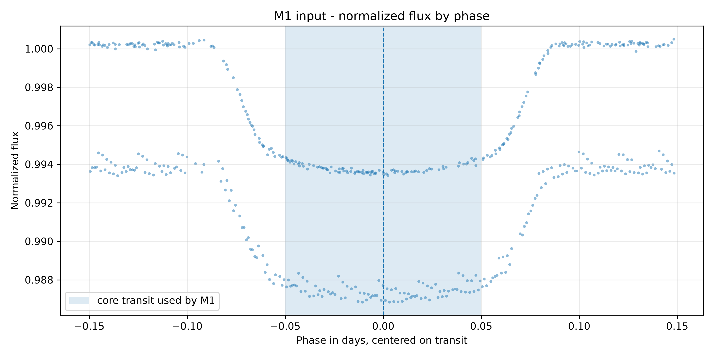
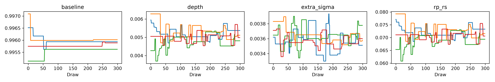
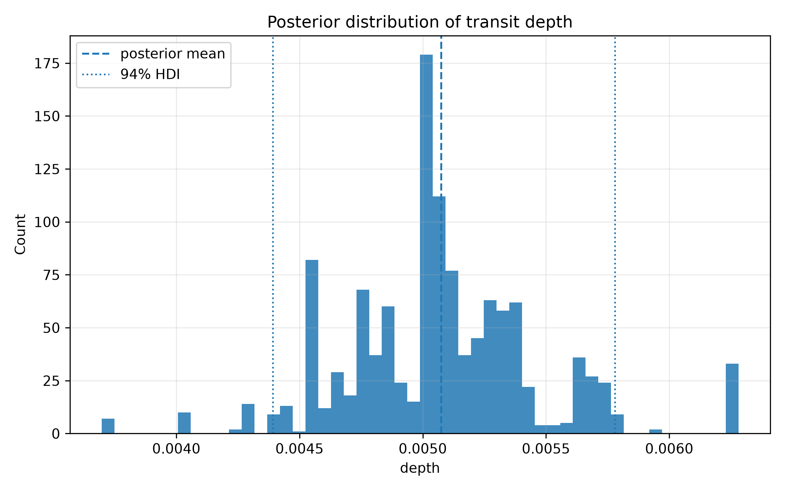
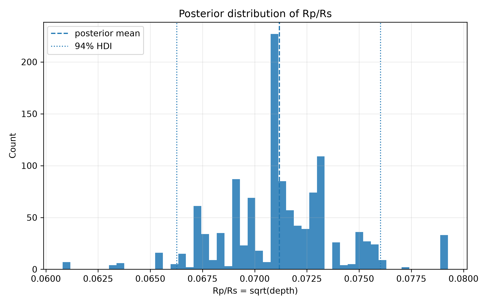
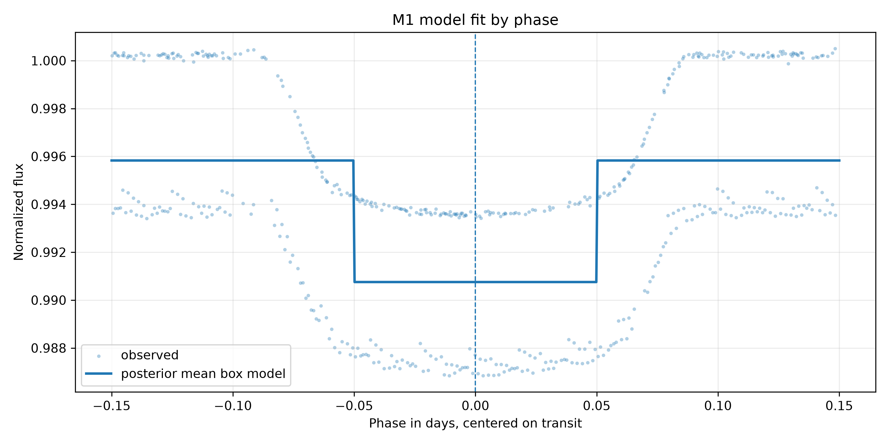

# Modelo Bayesiano M1 - Box Transit Baseline - HAT-P-7 b

## 1. Objetivo

Este relatório documenta o primeiro modelo bayesiano preliminar do projeto:
um baseline simples do tipo `box transit` para HAT-P-7 b.

O objetivo é estimar a profundidade média do trânsito como distribuição
posterior e derivar:

```text
Rp/Rs = sqrt(depth)
```

Este modelo não é a caracterização física final do planeta.

## 2. Papel do M1 na Sequência de Modelos

M1 é o baseline comparativo da sequência planejada:

- M1: box transit bayesiano simples;
- M2: modelo bayesiano preditivo de fluxo em função da fase;
- M3: modelo trapezoidal ou fisicamente mais estruturado;
- M4: comparação entre modelos.

M1 demonstra a lógica central do TCC: em vez de obter apenas um ponto estimado,
a inferência bayesiana fornece uma distribuição posterior para parâmetros de
interesse sob incerteza observacional.

## 3. Dataset Usado

Entrada Gold:

```text
data/gold/hat_p_7_b/modeling/transit_window_lightcurve.csv
```

Dataset efetivo do modelo:

```text
tables/bayesian_baseline/hat_p_7_b/modeling_input_baseline.csv
```

Número de pontos usados:

```text
516
```

Janela de fase usada:

```text
abs(phase) <= 0.15
```

## 4. Pré-processamento

Foram aplicados os seguintes filtros:

1. `abs(phase) <= 0.15`;
2. `quality == 0`, quando a coluna existe;
3. remoção de linhas sem `flux`;
4. remoção de linhas sem `flux_err`;
5. remoção de linhas com `flux_err <= 0`.

Resumo:

| Etapa | Linhas |
|---|---:|
| Janela Gold original | 1664 |
| Após filtro de fase | 516 |
| Após filtro de qualidade | 516 |
| Após remoção de ausências | 516 |
| Após exigir `flux_err > 0` | 516 |

## 5. Normalização Local

Região de baseline local:

```text
0.08 <= abs(phase) <= 0.15
```

Mediana usada:

```text
baseline_median = 1040715.45
```

Transformações:

```text
normalized_flux = flux / baseline_median
normalized_flux_err = flux_err / baseline_median
```

## 6. Especificação Probabilística

Para cada ponto `i`:

```text
y_i = normalized_flux_i
sigma_obs_i = normalized_flux_err_i
```

Se:

```text
abs(phase_i) <= 0.05
```

então:

```text
mu_i = baseline - depth
```

caso contrário:

```text
mu_i = baseline
```

## 7. Priors

```text
baseline ~ Normal(1.0, 0.01)
depth ~ HalfNormal(0.02)
extra_sigma ~ HalfNormal(0.005)
rp_rs = sqrt(depth)
```

## 8. Likelihood

```text
sigma_eff_i = sqrt(sigma_obs_i^2 + extra_sigma^2)
y_i ~ Normal(mu_i, sigma_eff_i)
```

## 9. Resultados Posteriores

Resumo posterior:

| parameter | mean | sd | hdi_3% | hdi_97% | ess_bulk | ess_tail | r_hat |
| --- | --- | --- | --- | --- | --- | --- | --- |
| baseline | 0.99583 | 0.0002507 | 0.995133 | 0.996172 | 5.07665 | 4.25513 | 2.33522 |
| depth | 0.00507495 | 0.00040659 | 0.00439089 | 0.0057799 | 11.8341 | 20.4624 | 1.27595 |
| extra_sigma | 0.00360586 | 0.00011876 | 0.0033801 | 0.00384425 | 23.158 | 29.1177 | 1.15527 |
| rp_rs | 0.0711817 | 0.00284967 | 0.0662638 | 0.0760256 | 11.8341 | 20.4624 | 1.27595 |

Profundidade posterior média:

```text
0.00507495
```

Intervalo de credibilidade de 94% para profundidade:

```text
[0.00439089, 0.0057799]
```

`Rp/Rs` posterior médio:

```text
0.07118168
```

Intervalo de credibilidade de 94% para `Rp/Rs`:

```text
[0.06626377, 0.07602563]
```

## 10. Diagnósticos MCMC

Configuração de amostragem:

```text
draws = 300
tune = 300
chains = 4
sampler = Metropolis
target_accept = 0.9 (not used by Metropolis)
random_seed = 42
requested_draws = 2000
requested_tune = 2000
reduced_from_requested = True
fallback_used = False
```

Maior R-hat:

```text
2.33522
```

Menor ESS:

```text
4.25513
```

O modelo convergiu adequadamente?

```text
requer revisão cautelosa
```

## 11. Posterior Predictive Check

Status:

```text
created
```

Tabela:

```text
tables/bayesian_baseline/hat_p_7_b/posterior_predictive_summary.csv
```

Figura:



## 12. Interpretação Astrofísica Preliminar

A profundidade visual exploratória da EDA foi:

```text
0.0065010088
```

O resultado é compatível com a profundidade visual exploratória?

```text
parcialmente; a ordem de grandeza é semelhante, mas revisar a simplificação box
```

Interpretação:

O modelo estima uma profundidade média simplificada de trânsito para uma forma
box-shaped. A distribuição posterior de `depth` mostra a incerteza associada a
essa simplificação e aos erros observacionais usados na likelihood.

## 13. Limitações

Este modelo:

- é um baseline bayesiano;
- usa forma box-shaped;
- fixa a meia largura do trânsito em `0.05` dias;
- ignora limb darkening;
- ignora geometria orbital completa;
- ignora ingresso e egresso;
- assume independência condicional dos erros;
- usa apenas Kepler PDCSAP;
- não compara modelos;
- não deve ser interpretado como caracterização física final.

## 14. Próximos Modelos Planejados

Próxima etapa recomendada:

```text
M2 - modelo bayesiano preditivo de fluxo em função da fase
```

O M2 deve avaliar se uma forma mais flexível melhora a capacidade preditiva e
os posterior predictive checks em relação ao baseline M1.

## Figuras Geradas










