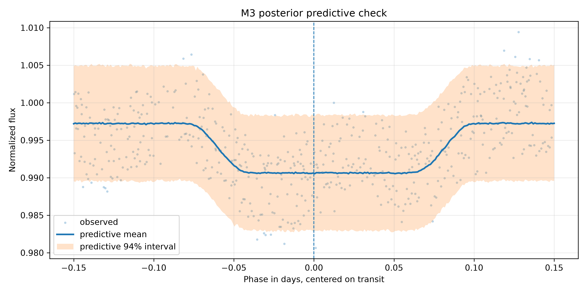
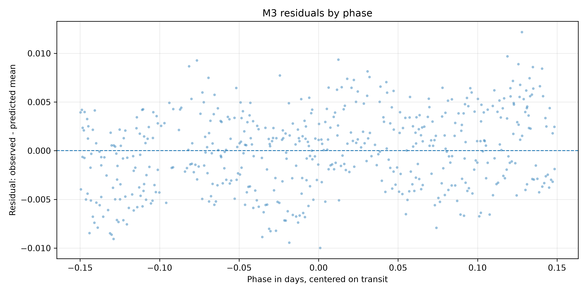
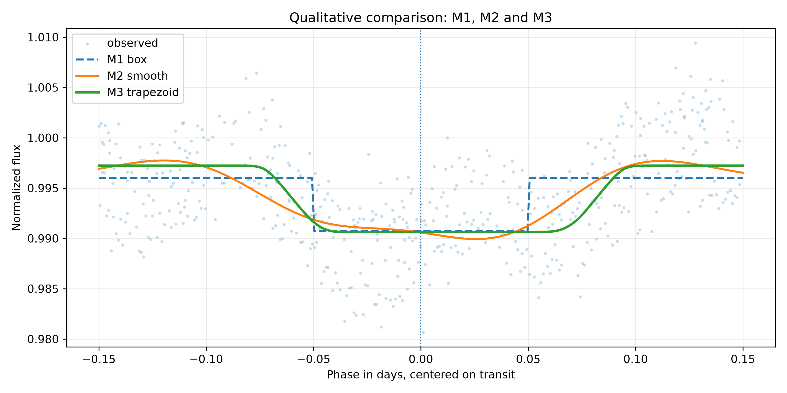

# M3 - Bayesian Trapezoid Transit - HAT-P-7 b

## 1. Objetivo do M3

O M3 aproxima o trânsito de HAT-P-7 b por uma forma trapezoidal bayesiana. O
modelo estima profundidade, centro, duração total aproximada, ingresso/egresso,
baseline e ruído extra.

## 2. Diferença Entre M1, M2 e M3

- M1 estima uma profundidade em uma forma box-shaped fixa.
- M2 estima uma função suave preditiva em fase, sem parâmetros físicos diretos.
- M3 estima uma forma trapezoidal paramétrica, mais interpretável que M2 e mais flexível que M1.

## 3. Dataset Usado

Entrada:

```text
data/gold/hat_p_7_b/modeling/transit_window_lightcurve.csv
```

Dataset efetivo:

```text
tables/bayesian_noise_injection/hat_p_7_b/modeling_input_trapezoid.csv
```

Pontos usados:

```text
516
```

## 4. Pré-processamento

Foram mantidas as regras de M1/M2:

- `abs(phase) <= 0.15`;
- `quality == 0`;
- remoção de `phase`, `flux` ou `flux_err` ausentes;
- remoção de `flux_err <= 0`;
- normalização local pela mediana em `0,08 <= abs(phase) <= 0,15`.

Baseline mediano:

```text
1040715.45
```

## 5. Especificação Trapezoidal

Com `d = abs(phase - center)`:

```text
transit_shape = clip((half_duration - d) / ingress_duration, 0, 1)
mu = baseline - depth * transit_shape
```

Essa forma produz:

- `transit_shape = 1` no fundo plano;
- `0 < transit_shape < 1` no ingresso/egresso;
- `transit_shape = 0` fora do trânsito.

## 6. Priors

```text
baseline ~ Normal(1.0, 0.01)
depth ~ HalfNormal(0.02)
center ~ Normal(0.0, 0.01)
half_duration ~ Uniform(0.03, 0.12)
ingress_fraction ~ Beta(2, 5)
ingress_duration = ingress_fraction * half_duration
extra_sigma ~ HalfNormal(0.005)
```

## 7. Likelihood

```text
sigma_eff_i = sqrt(normalized_flux_err_i^2 + extra_sigma^2)
normalized_flux_i ~ Normal(mu_i, sigma_eff_i)
```

## 8. Resultados Posteriores

Arquivo:

```text
tables/bayesian_noise_injection/hat_p_7_b/posterior_summary.csv
```

Resumo:

| parameter | mean | hdi_3% | hdi_97% | r_hat | ess_bulk | ess_tail |
| --- | --- | --- | --- | --- | --- | --- |
| baseline | 0.99722988 | 0.99671441 | 0.99773194 | 1.00021917 | 5284.76102313 | 5282.86674051 |
| depth | 0.00660039 | 0.00583728 | 0.00734764 | 1.00032869 | 5007.10849657 | 5074.01234552 |
| center | 0.010782 | 0.00737242 | 0.0140754 | 1.00135589 | 6429.92206973 | 5164.22177745 |
| half_duration | 0.08411821 | 0.07746844 | 0.09082045 | 1.00020835 | 4701.2223751 | 4167.04304226 |
| ingress_duration | 0.0274905 | 0.01406 | 0.04084302 | 0.99991628 | 4230.19585011 | 3952.28488274 |
| extra_sigma | 0.00407627 | 0.00384288 | 0.00432572 | 1.00071476 | 7640.09847205 | 5427.95648738 |
| rp_rs | 0.08120447 | 0.07640212 | 0.0857184 | 1.00030589 | 5007.10849657 | 5074.01234552 |

## 9. Parâmetros Derivados

Arquivo:

```text
tables/bayesian_noise_injection/hat_p_7_b/derived_parameters_summary.csv
```

Principais resultados:

```text
depth = 0.00660039, HDI 94% [0.00583728, 0.00734764]
Rp/Rs = 0.08120447, HDI 94% [0.07640212, 0.08571840]
center = 0.01078200, HDI 94% [0.00737242, 0.01407540]
full_duration = 0.16823642 dias = 4.0377 horas
ingress_duration = 0.02749050 dias = 0.6598 horas
```

## 10. Posterior Predictive Check

Arquivo:

```text
tables/bayesian_noise_injection/hat_p_7_b/posterior_predictive_summary.csv
```

Cobertura aproximada do intervalo preditivo de 94% nos pontos observados:

```text
0.957364
```

Figura:



## 11. Resíduos

Arquivo:

```text
tables/bayesian_noise_injection/hat_p_7_b/residual_summary.csv
```

Métricas:

- média dos resíduos: `-0.00000361`
- mediana dos resíduos: `0.00029020`
- desvio padrão dos resíduos: `0.00405437`
- desvio padrão dos resíduos padronizados: `0.89292370`

Figura:



## 12. Comparação Qualitativa com M1 e M2

M1 depth robusto:

```text
0.00525258
```

M2:

```text
M2 curve available.
```

Figura:



## 13. Diagnósticos MCMC

- sampler: `NUTS`
- draws: `2000`
- tune: `2000`
- chains: `4`
- target_accept final: `0.9`
- divergências: `0`
- R-hat máximo: `1.00135589`
- ESS mínimo: `3952.28488274`
- aceitação média: `0.89894849`
- BFMI mínimo: `0.92228257`
- recomendado para interpretação M3: `True`

Nota:

```text
NUTS diagnostics satisfy the project criteria for M3 interpretation.
```

## 14. Interpretação Astrofísica Preliminar

M3 é mais interpretável que M2 porque estima explicitamente profundidade,
centro e durações aproximadas. Também é mais flexível que M1 por incluir
ingresso e egresso.

## 15. Limitações

M3 ainda:

- não usa limb darkening;
- não usa geometria orbital completa;
- não usa Mandel & Agol;
- assume erros independentes condicionais;
- usa apenas Kepler;
- não é modelo físico final.

## 16. Próximos Passos

O próximo passo é M4: comparação de M1, M2 e M3 por posterior predictive
checks, erro preditivo e, se adequado, LOO/WAIC.
