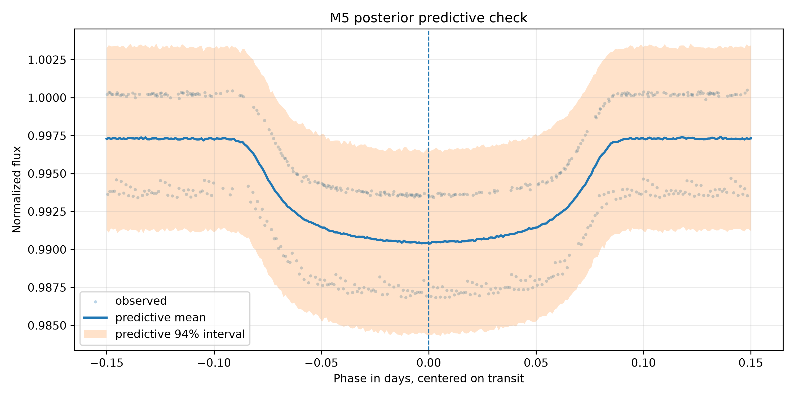
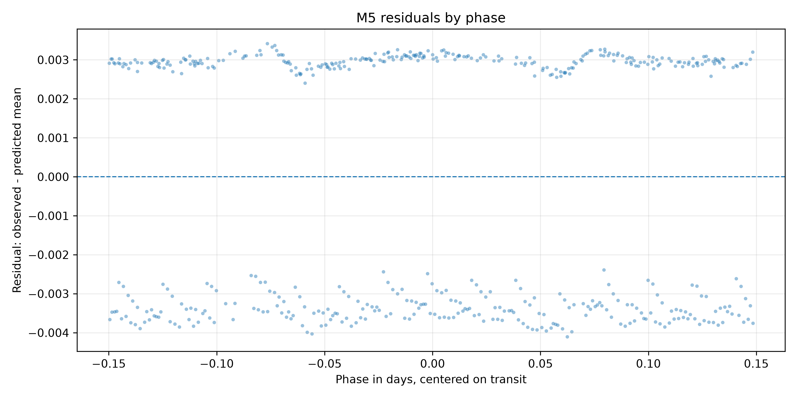
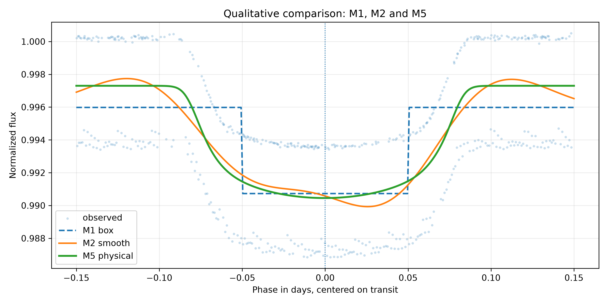

# M5 - Bayesian Physical Transit - HAT-P-7 b

## 1. Objetivo do M5

O M5 aproxima o trânsito de HAT-P-7 b por uma forma physicalal bayesiana. O
modelo estima profundidade, centro, duração total aproximada, ingresso/egresso,
baseline e ruído extra.

## 2. Diferença Entre M1, M2 e M5

- M1 estima uma profundidade em uma forma box-shaped fixa.
- M2 estima uma função suave preditiva em fase, sem parâmetros físicos diretos.
- M5 estima uma forma physicalal paramétrica, mais interpretável que M2 e mais flexível que M1.

## 3. Dataset Usado

Entrada:

```text
data/gold/kepler_10_b/modeling/transit_window_lightcurve.csv
```

Dataset efetivo:

```text
tables/bayesian_physical_transit/kepler_10_b/modeling_input_physical.csv
```

Pontos usados:

```text
1877
```

## 4. Pré-processamento

Foram mantidas as regras de M1/M2:

- `abs(phase) <= 0.15`;
- `quality == 0`;
- remoção de `phase`, `flux` ou `flux_err` ausentes;
- remoção de `flux_err <= 0`;
- normalização local pela mediana em `0,08 <= abs(phase) <= 0,15`.

Baseline mediano:

```text
556917.75
```

## 5. Especificação Physicalal

Com `d = abs(phase - center)`:

```text
transit_shape = clip((half_duration - d) / ingress_duration, 0, 1)
mu = baseline - depth * transit_shape
```

Essa forma produz:

- `transit_shape = 1` no fundo plano;
- `0 < transit_shape < 1` no ingresso/egresso;
- `transit_shape = 0` fora do trânsito.

## 6. Priors

```text
baseline ~ Normal(1.0, 0.01)
depth ~ HalfNormal(0.02)
center ~ Normal(0.0, 0.01)
half_duration ~ Uniform(0.03, 0.12)
ingress_fraction ~ Beta(2, 5)
ingress_duration = ingress_fraction * half_duration
extra_sigma ~ HalfNormal(0.005)
```

## 7. Likelihood

```text
sigma_eff_i = sqrt(normalized_flux_err_i^2 + extra_sigma^2)
normalized_flux_i ~ Normal(mu_i, sigma_eff_i)
```

## 8. Resultados Posteriores

Arquivo:

```text
tables/bayesian_physical_transit/kepler_10_b/posterior_summary.csv
```

Resumo:

| parameter | mean | hdi_3% | hdi_97% | r_hat | ess_bulk | ess_tail |
| --- | --- | --- | --- | --- | --- | --- |
| baseline | 0.98926036 | 0.98822998 | 0.99028388 | 1.00071724 | 4576.227379 | 4125.11128778 |
| extra_sigma | 0.02480444 | 0.02422717 | 0.02541926 | 0.99992163 | 5828.30426623 | 4839.37293159 |
| depth | 0.00209249 | 0.00093203 | 0.00248783 | 1.00101963 | 3088.36152422 | 3019.09883657 |
| rp_rs | 0.04537921 | 0.0305291 | 0.04987817 | 1.00101044 | 3088.36152422 | 3019.09883657 |

## 9. Parâmetros Derivados

Arquivo:

```text
tables/bayesian_physical_transit/kepler_10_b/derived_parameters_summary.csv
```

Principais resultados:

```text
depth = 0.00209249, HDI 94% [0.00093203, 0.00248783]
Rp/Rs = 0.04537921, HDI 94% [0.03052910, 0.04987817]
center = nan, HDI 94% [nan, nan]
full_duration = 0.30068640 dias = 7.2165 horas
ingress_duration = nan dias = nan horas
```

## 10. Posterior Predictive Check

Arquivo:

```text
tables/bayesian_physical_transit/kepler_10_b/posterior_predictive_summary.csv
```

Cobertura aproximada do intervalo preditivo de 94% nos pontos observados:

```text
0.909963
```

Figura:



## 11. Resíduos

Arquivo:

```text
tables/bayesian_physical_transit/kepler_10_b/residual_summary.csv
```

Métricas:

- média dos resíduos: `-0.00351816`
- mediana dos resíduos: `0.01080354`
- desvio padrão dos resíduos: `0.02835304`
- desvio padrão dos resíduos padronizados: `1.14306180`

Figura:



## 12. Comparação Qualitativa com M1 e M2

M1 depth robusto:

```text
None
```

M2:

```text
M2 curve unavailable.
```

Figura:



## 13. Diagnósticos MCMC

- sampler: `NUTS`
- draws: `2000`
- tune: `2000`
- chains: `4`
- target_accept final: `0.9`
- divergências: `0`
- R-hat máximo: `1.00223414`
- ESS mínimo: `1476.77896935`
- aceitação média: `0.89211153`
- BFMI mínimo: `0.77171858`
- recomendado para interpretação M5: `True`

Nota:

```text
NUTS diagnostics satisfy the project criteria for M5 interpretation.
```

## 14. Interpretação Astrofísica Preliminar

M5 é mais interpretável que M2 porque estima explicitamente profundidade,
centro e durações aproximadas. Também é mais flexível que M1 por incluir
ingresso e egresso.

## 15. Limitações

M5 ainda:

- não usa limb darkening;
- não usa geometria orbital completa;
- não usa Mandel & Agol;
- assume erros independentes condicionais;
- usa apenas Kepler;
- não é modelo físico final.

## 16. Próximos Passos

O próximo passo é M4: comparação de M1, M2 e M5 por posterior predictive
checks, erro preditivo e, se adequado, LOO/WAIC.
