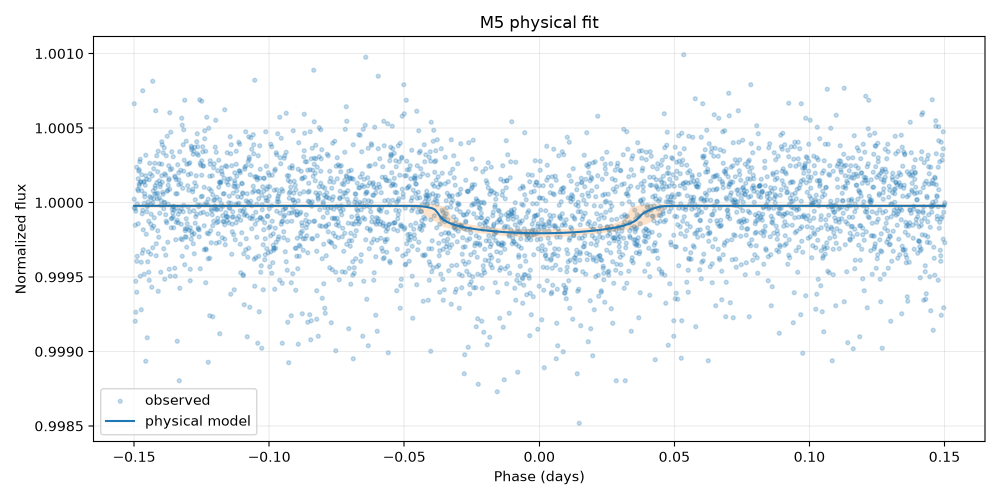
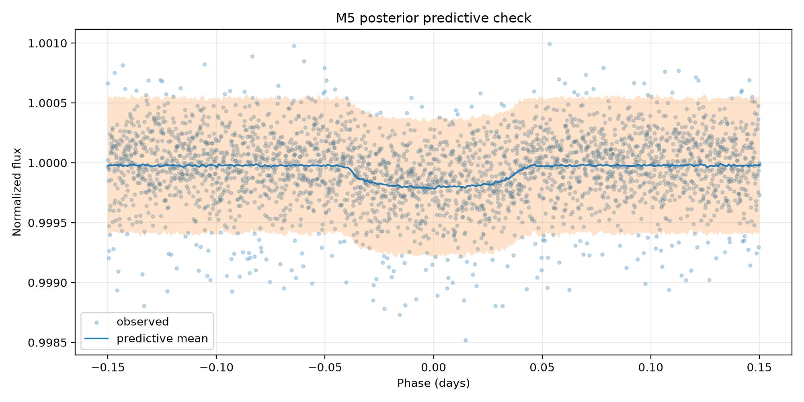

# M5 — trânsito físico bayesiano — Kepler-10 b

## Escopo e identidade

- alvo: `Kepler-10 b` (`kepler_10_b`)
- estrela: `Kepler-10`
- missão: `Kepler`
- run: `scientific_001`
- dataset Gold: `kepler_10_b-06a6ce6b0b39f5b4`
- entrada: `data/gold/kepler_10_b/modeling/transit_window_lightcurve.csv`
- segmentos: `3`
- exposição mediana: `58.848763 s`

O M5 só aceita Gold certificado como `segment_normalized`. A normalização foi
feita separadamente por segmento antes da concatenação; o M5 não aplica uma
segunda normalização global.

## Modelo executado

O modelo é um trânsito Kepleriano circular com escurecimento de bordo
quadrático, implementado por `exoplanet.KeplerianOrbit` e
`exoplanet.LimbDarkLightCurve`. O período fixado foi
`0.8374907 d`, proveniente da configuração autoritativa
do alvo. Cada ponto é integrado pelo seu tempo de exposição com oversampling
`15`.

Parâmetros livres: baseline, `Rp/Rs` (`r`), parâmetro de impacto (`b`),
semieixo maior escalado (`a/Rs`), centro do trânsito (`t0`), coeficientes de
limb darkening e jitter branco adicional (`extra_sigma`). A likelihood é
Normal com `sqrt(flux_err² + extra_sigma²)`. Isso não é um modelo de ruído
vermelho ou correlacionado.

## Posterior

| parameter | mean | r_hat | ess_bulk | ess_tail |
| --- | --- | --- | --- | --- |
| baseline | 0.99997731 | 1.00193197 | 2135.09233193 | 2017.66717521 |
| r | 0.01249085 | 1.00434435 | 741.9954266 | 806.60974995 |
| b | 0.40921597 | 1.00508421 | 690.27294161 | 628.82158016 |
| a | 3.07827218 | 1.00506349 | 705.17899122 | 582.0676616 |
| t0 | 0.000556 | 1.00138735 | 2149.56864494 | 1903.64744896 |
| u[0] | 0.67628934 | 1.00085492 | 1984.82837598 | 1823.28253819 |
| u[1] | 0.04506721 | 1.00002096 | 2298.49922945 | 2000.89798268 |
| extra_sigma | 0.00021499 | 0.99998573 | 2767.92883771 | 2007.68381507 |
| depth | 0.00015692 | 1.00434435 | 741.9954266 | 806.60974995 |
| full_duration | 0.07924242 | 1.00236637 | 1456.22550721 | 1784.07420495 |

Valores derivados principais:

- profundidade geométrica média: `0.0001569200` em fração de fluxo (`0.01569200%`)
- `Rp/Rs`: `0.01249085`
- duração total: `0.07924242 d` (`1.90182 h`)
- centro do trânsito: `0.00055600 d` na fase centrada

## Diagnósticos e gates

- R-hat máximo: `1.00508421`
- ESS mínimo: `582.0676616`
- divergências: `0`
- BFMI mínimo: `None`
- cobertura PPC de 94%: `0.9336666666666666`
- desvio dos resíduos padronizados: `1.0035717127085844`
- sampler convergiu: `False`
- PPC adequado: `True`
- cientificamente interpretável: `False`

Motivos de rejeição:

- bfmi_min=None is unavailable or below 0.30

Uma cadeia convergida não basta para interpretação física. O status científico
também exige Gold segmentado, exposição conhecida, PPC adequado e ausência de
sinais graves de dominância do jitter ou saturação do prior de `Rp/Rs`.

## Artefatos

- configuração executada: `models/bayesian_physical_transit/kepler_10_b/runs/scientific_001/model_config.json`
- trace com log-likelihood pontual: `models/bayesian_physical_transit/kepler_10_b/runs/scientific_001/trace.nc`
- resumo posterior: `tables/bayesian_physical_transit/kepler_10_b/runs/scientific_001/posterior_summary.csv`
- resumo derivado: `tables/bayesian_physical_transit/kepler_10_b/runs/scientific_001/derived_parameters_summary.csv`
- PPC: `tables/bayesian_physical_transit/kepler_10_b/runs/scientific_001/posterior_predictive_summary.csv`
- resíduos: `tables/bayesian_physical_transit/kepler_10_b/runs/scientific_001/residual_summary.csv`

## Limitações

O período é fixo; a órbita assume excentricidade zero; parâmetros estelares não
são inferidos conjuntamente; o jitter é branco e independente; e a
profundidade `r²` é uma referência geométrica, não necessariamente a
profundidade aparente sob limb darkening. Comparações LOO/WAIC só são válidas
entre execuções que usam exatamente as mesmas observações e o mesmo alvo da
likelihood.
