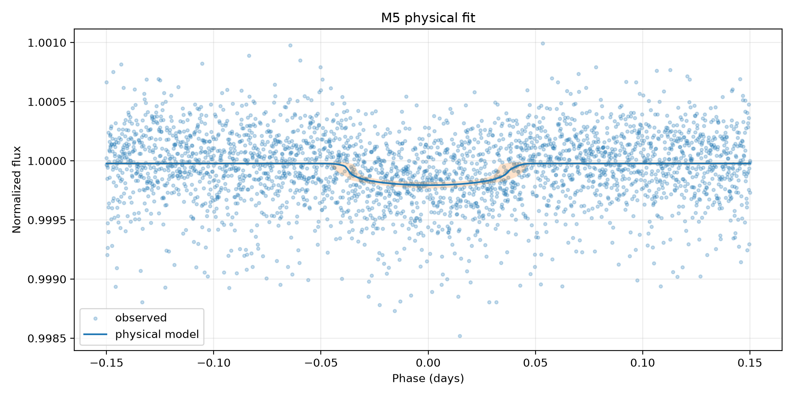
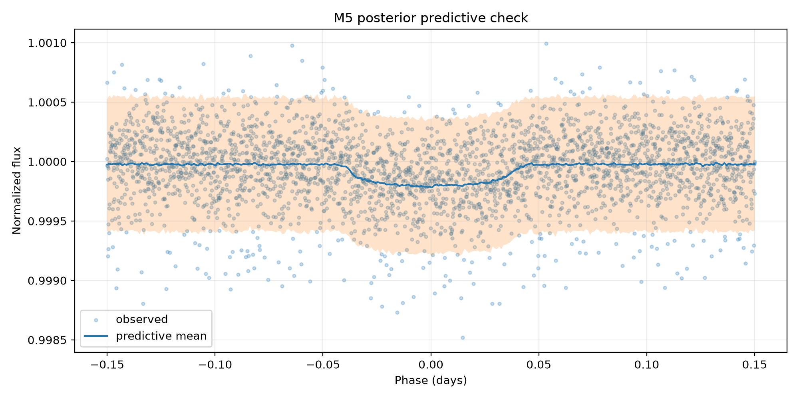

# M5 — trânsito físico bayesiano — Kepler-10 b

## Escopo e identidade

- alvo: `Kepler-10 b` (`kepler_10_b`)
- estrela: `Kepler-10`
- missão: `Kepler`
- run: `sensitivity_001_weak`
- dataset Gold: `kepler_10_b-06a6ce6b0b39f5b4`
- entrada: `data/gold/kepler_10_b/modeling/transit_window_lightcurve.csv`
- segmentos: `3`
- exposição mediana: `58.848763 s`

O M5 só aceita Gold certificado como `segment_normalized`. A normalização foi
feita separadamente por segmento antes da concatenação; o M5 não aplica uma
segunda normalização global.

## Modelo executado

O modelo é um trânsito Kepleriano circular com escurecimento de bordo
quadrático, implementado por `exoplanet.KeplerianOrbit` e
`exoplanet.LimbDarkLightCurve`. O período fixado foi
`0.8374907 d`, proveniente da configuração autoritativa
do alvo. Cada ponto é integrado pelo seu tempo de exposição com oversampling
`15`.

Parâmetros livres: baseline, `Rp/Rs` (`r`), parâmetro de impacto (`b`),
semieixo maior escalado (`a/Rs`), centro do trânsito (`t0`), coeficientes de
limb darkening e jitter branco adicional (`extra_sigma`). A likelihood é
Normal com `sqrt(flux_err² + extra_sigma²)`. Isso não é um modelo de ruído
vermelho ou correlacionado.

## Posterior

| parameter | mean | hdi_3% | hdi_97% | r_hat | ess_bulk | ess_tail |
| --- | --- | --- | --- | --- | --- | --- |
| baseline | 0.99997709 | 0.99996502 | 0.99998944 | 1.00111405 | 2521.01034746 | 2027.41019413 |
| r | 0.01239437 | 0.01083865 | 0.01428025 | 1.00341764 | 951.49327403 | 1098.96748015 |
| b | 0.38803722 | 0.01363628 | 0.80805303 | 1.00441562 | 800.64801586 | 846.02562962 |
| a | 3.11565057 | 2.20295188 | 3.7495769 | 1.0045834 | 957.32334746 | 898.8846081 |
| t0 | 0.00045309 | -0.00307874 | 0.00386004 | 1.00358948 | 1958.45847779 | 1517.22959664 |
| u[0] | 0.67684993 | 0.03835746 | 1.59179526 | 1.00259645 | 2050.39847708 | 1987.86790948 |
| u[1] | 0.03973415 | -0.71547428 | 0.77594923 | 1.00172029 | 2447.29220119 | 2044.18983483 |
| extra_sigma | 0.0002146 | 0.00020444 | 0.00022482 | 1.00080217 | 2544.17058777 | 2070.05702835 |
| depth | 0.00015442 | 0.00011748 | 0.00020393 | 1.00341764 | 951.49327403 | 1098.96748015 |
| full_duration | 0.07915623 | 0.07039681 | 0.09136222 | 1.00317438 | 1757.87724361 | 1695.16399894 |

Valores derivados principais:

- profundidade geométrica média: `0.0001544200` em fração de fluxo (`0.01544200%`)
- `Rp/Rs`: `0.01239437`
- duração total: `0.07915623 d` (`1.89975 h`)
- centro do trânsito: `0.00045309 d` na fase centrada

## Prior predictive check

- amostras: `500`
- referência catalogada de `Rp/Rs` dentro do intervalo prior de 94%: `True`
- fração de curvas prior com valores finitos: `1.0`
- cobertura das observações pelo intervalo prior-preditivo de 94%: `1.0`
- tabela: `tables/bayesian_physical_transit/kepler_10_b/runs/sensitivity_001_weak/prior_predictive_summary.csv`

## Diagnósticos e gates

- R-hat máximo: `1.0045834`
- ESS mínimo: `800.64801586`
- divergências: `0`
- BFMI mínimo: `0.7471179922306367`
- cobertura PPC de 94%: `0.9336666666666666`
- desvio dos resíduos padronizados: `1.0044961458069845`
- sampler convergiu: `True`
- PPC adequado: `True`
- cientificamente interpretável: `True`

Motivos de rejeição:

Nenhum.

Uma cadeia convergida não basta para interpretação física. O status científico
também exige Gold segmentado, exposição conhecida, PPC adequado e ausência de
sinais graves de dominância do jitter ou saturação do prior de `Rp/Rs`.

## Artefatos

- configuração executada: `models/bayesian_physical_transit/kepler_10_b/runs/sensitivity_001_weak/model_config.json`
- trace com log-likelihood pontual: `models/bayesian_physical_transit/kepler_10_b/runs/sensitivity_001_weak/trace.nc`
- resumo posterior: `tables/bayesian_physical_transit/kepler_10_b/runs/sensitivity_001_weak/posterior_summary.csv`
- resumo derivado: `tables/bayesian_physical_transit/kepler_10_b/runs/sensitivity_001_weak/derived_parameters_summary.csv`
- PPC: `tables/bayesian_physical_transit/kepler_10_b/runs/sensitivity_001_weak/posterior_predictive_summary.csv`
- resíduos: `tables/bayesian_physical_transit/kepler_10_b/runs/sensitivity_001_weak/residual_summary.csv`

## Limitações

O período é fixo; a órbita assume excentricidade zero; parâmetros estelares não
são inferidos conjuntamente; o jitter é branco e independente; e a
profundidade `r²` é uma referência geométrica, não necessariamente a
profundidade aparente sob limb darkening. Comparações LOO/WAIC só são válidas
entre execuções que usam exatamente as mesmas observações e o mesmo alvo da
likelihood.
