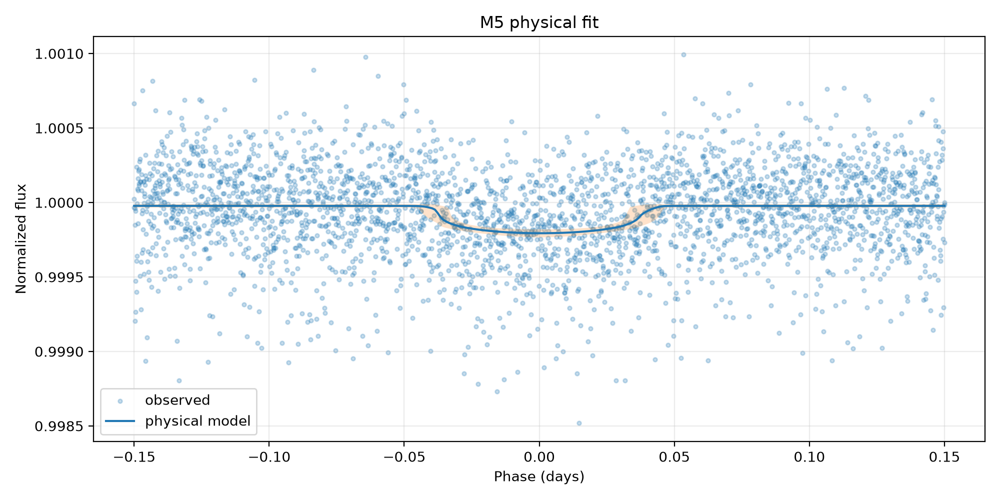
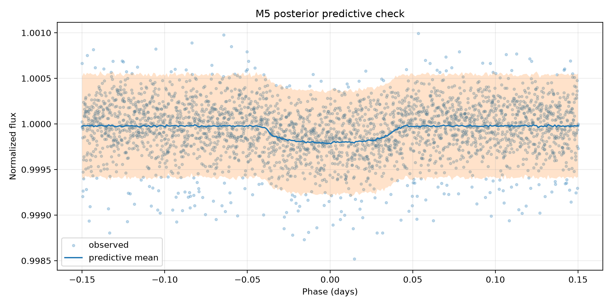

# M5 — trânsito físico bayesiano — Kepler-10 b

## Escopo e identidade

- alvo: `Kepler-10 b` (`kepler_10_b`)
- estrela: `Kepler-10`
- missão: `Kepler`
- run: `sensitivity_002_catalog_tighter`
- dataset Gold: `kepler_10_b-b4d1e6ec961c1f4d`
- entrada: `data/gold/kepler_10_b/modeling/transit_window_lightcurve.csv`
- segmentos: `3`
- exposição mediana: `58.848763 s`

O M5 só aceita Gold certificado como `segment_normalized`. A normalização foi
feita separadamente por segmento antes da concatenação; o M5 não aplica uma
segunda normalização global.

## Modelo executado

O modelo é um trânsito Kepleriano circular com escurecimento de bordo
quadrático, implementado por `exoplanet.KeplerianOrbit` e
`exoplanet.LimbDarkLightCurve`. O período fixado foi
`0.8374907 d`, proveniente da configuração autoritativa
do alvo. Cada ponto é integrado pelo seu tempo de exposição com oversampling
`15`.

Parâmetros livres: baseline, `Rp/Rs` (`r`), parâmetro de impacto (`b`),
semieixo maior escalado (`a/Rs`), centro do trânsito (`t0`), coeficientes de
limb darkening e jitter branco adicional (`extra_sigma`). A likelihood é
Normal com `sqrt(flux_err² + extra_sigma²)`. Isso não é um modelo de ruído
vermelho ou correlacionado.

## Posterior

| parameter | mean | hdi_3% | hdi_97% | r_hat | ess_bulk | ess_tail |
| --- | --- | --- | --- | --- | --- | --- |
| baseline | 0.99997737 | 0.99996538 | 0.99998922 | 1.00265206 | 2474.14760966 | 2102.8987917 |
| r | 0.01246806 | 0.01103214 | 0.01423397 | 1.00111088 | 786.51042114 | 858.14836331 |
| b | 0.4021583 | 0.02826303 | 0.80947731 | 1.00221702 | 652.66797512 | 676.87530329 |
| a | 3.10375144 | 2.19402132 | 3.75207145 | 1.00377887 | 684.26695488 | 616.52762201 |
| t0 | 0.00052394 | -0.00294799 | 0.00396915 | 1.00097099 | 2113.14359029 | 1789.47313133 |
| u[0] | 0.65708076 | 0.03570091 | 1.5148792 | 1.00078473 | 1831.54757698 | 1873.35824023 |
| u[1] | 0.05485409 | -0.66157355 | 0.79907485 | 1.0005522 | 2325.35891932 | 2020.90146896 |
| extra_sigma | 0.00021486 | 0.00020445 | 0.00022537 | 1.00271258 | 2610.86033128 | 2103.13774078 |
| depth | 0.00015618 | 0.00012171 | 0.00020261 | 1.00111088 | 786.51042114 | 858.14836331 |
| full_duration | 0.07897254 | 0.06999032 | 0.09036254 | 1.00244664 | 1651.92779526 | 1359.78406701 |

Valores derivados principais:

- profundidade geométrica média: `0.0001561800` em fração de fluxo (`0.01561800%`)
- `Rp/Rs`: `0.01246806`
- duração total: `0.07897254 d` (`1.89534 h`)
- centro do trânsito: `0.00052394 d` na fase centrada

## Prior predictive check

- amostras: `500`
- referência catalogada de `Rp/Rs` dentro do intervalo prior de 94%: `True`
- fração de curvas prior com valores finitos: `1.0`
- cobertura das observações pelo intervalo prior-preditivo de 94%: `1.0`
- tabela: `tables/bayesian_physical_transit/kepler_10_b/runs/sensitivity_002_catalog_tighter/prior_predictive_summary.csv`

## Diagnósticos e gates

- R-hat máximo: `1.00377887`
- ESS mínimo: `616.52762201`
- divergências: `0`
- BFMI mínimo: `0.8126776041632984`
- cobertura PPC de 94%: `0.9333333333333333`
- desvio dos resíduos padronizados: `1.0038772946786736`
- sampler convergiu: `True`
- PPC adequado: `True`
- cientificamente interpretável: `True`

Motivos de rejeição:

Nenhum.

Uma cadeia convergida não basta para interpretação física. O status científico
também exige Gold segmentado, exposição conhecida, PPC adequado e ausência de
sinais graves de dominância do jitter ou saturação do prior de `Rp/Rs`.

## Artefatos

- configuração executada: `models/bayesian_physical_transit/kepler_10_b/runs/sensitivity_002_catalog_tighter/model_config.json`
- trace com log-likelihood pontual: `models/bayesian_physical_transit/kepler_10_b/runs/sensitivity_002_catalog_tighter/trace.nc`
- resumo posterior: `tables/bayesian_physical_transit/kepler_10_b/runs/sensitivity_002_catalog_tighter/posterior_summary.csv`
- resumo derivado: `tables/bayesian_physical_transit/kepler_10_b/runs/sensitivity_002_catalog_tighter/derived_parameters_summary.csv`
- PPC: `tables/bayesian_physical_transit/kepler_10_b/runs/sensitivity_002_catalog_tighter/posterior_predictive_summary.csv`
- resíduos: `tables/bayesian_physical_transit/kepler_10_b/runs/sensitivity_002_catalog_tighter/residual_summary.csv`

## Limitações

O período é fixo; a órbita assume excentricidade zero; parâmetros estelares não
são inferidos conjuntamente; o jitter é branco e independente; e a
profundidade `r²` é uma referência geométrica, não necessariamente a
profundidade aparente sob limb darkening. Comparações LOO/WAIC só são válidas
entre execuções que usam exatamente as mesmas observações e o mesmo alvo da
likelihood.
