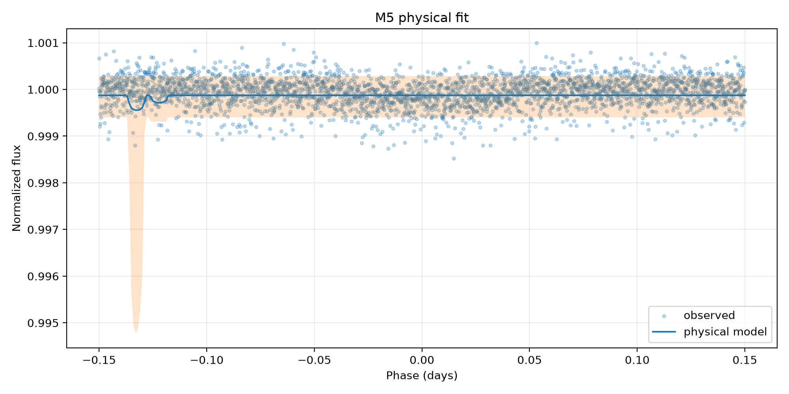
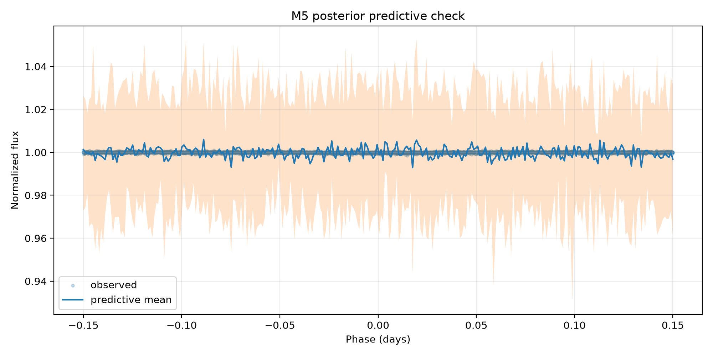

# M5 — trânsito físico bayesiano — Kepler-10 b

## Escopo e identidade

- alvo: `Kepler-10 b` (`kepler_10_b`)
- estrela: `Kepler-10`
- missão: `Kepler`
- run: `smoke_005`
- dataset Gold: `kepler_10_b-06a6ce6b0b39f5b4`
- entrada: `data/gold/kepler_10_b/modeling/transit_window_lightcurve.csv`
- segmentos: `3`
- exposição mediana: `58.848763 s`

O M5 só aceita Gold certificado como `segment_normalized`. A normalização foi
feita separadamente por segmento antes da concatenação; o M5 não aplica uma
segunda normalização global.

## Modelo executado

O modelo é um trânsito Kepleriano circular com escurecimento de bordo
quadrático, implementado por `exoplanet.KeplerianOrbit` e
`exoplanet.LimbDarkLightCurve`. O período fixado foi
`0.8374907 d`, proveniente da configuração autoritativa
do alvo. Cada ponto é integrado pelo seu tempo de exposição com oversampling
`15`.

Parâmetros livres: baseline, `Rp/Rs` (`r`), parâmetro de impacto (`b`),
semieixo maior escalado (`a/Rs`), centro do trânsito (`t0`), coeficientes de
limb darkening e jitter branco adicional (`extra_sigma`). A likelihood é
Normal com `sqrt(flux_err² + extra_sigma²)`. Isso não é um modelo de ruído
vermelho ou correlacionado.

## Posterior

| parameter | mean | r_hat | ess_bulk | ess_tail |
| --- | --- | --- | --- | --- |
| baseline | 0.99987419 | 1.49240484 | 11.84490626 | 14.0803173 |
| r | 0.10440553 | 2.80344803 | 3.73950074 | 6.46319569 |
| b | 0.44340653 | 2.34989362 | 4.03972272 | 7.28744939 |
| a | 30.84963742 | 1.84164803 | 4.52401644 | 10.79027356 |
| t0 | -0.18490812 | 3.05511959 | 3.65602967 | 6.46319569 |
| u[0] | 0.53391933 | 2.29188159 | 4.01260437 | 6.56934307 |
| u[1] | 0.09052557 | 2.50097797 | 3.8974068 | 8.91089109 |
| extra_sigma | 0.01251956 | 3.10433584 | 3.64260666 | 6.46319569 |
| depth | 0.01197041 | 2.80344803 | 3.73950074 | 6.46319569 |
| full_duration | 0.00875568 | 2.24693139 | 4.08697735 | 10.79027356 |

Valores derivados principais:

- profundidade geométrica média: `0.0119704100` em fração de fluxo (`1.19704100%`)
- `Rp/Rs`: `0.10440553`
- duração total: `0.00875568 d` (`0.21014 h`)
- centro do trânsito: `-0.18490812 d` na fase centrada

## Diagnósticos e gates

- R-hat máximo: `3.10433584`
- ESS mínimo: `3.64260666`
- divergências: `0`
- BFMI mínimo: `None`
- cobertura PPC de 94%: `1.0`
- desvio dos resíduos padronizados: `0.02528347439506499`
- sampler convergiu: `False`
- PPC adequado: `False`
- cientificamente interpretável: `False`

Motivos de rejeição:

- max_r_hat=3.10433584 exceeds 1.01
- min_ess=3.64260666 is below 400
- bfmi_min=None is unavailable or below 0.30
- 94% coverage=1.0 is outside [0.80, 0.99]
- standardized residual std=0.02528347439506499 is outside [0.5, 2.0]
- extra_sigma/measurement_sigma=59.26417898113537 exceeds review threshold 20

Uma cadeia convergida não basta para interpretação física. O status científico
também exige Gold segmentado, exposição conhecida, PPC adequado e ausência de
sinais graves de dominância do jitter ou saturação do prior de `Rp/Rs`.

## Artefatos

- configuração executada: `models/bayesian_physical_transit/kepler_10_b/runs/smoke_005/model_config.json`
- trace com log-likelihood pontual: `models/bayesian_physical_transit/kepler_10_b/runs/smoke_005/trace.nc`
- resumo posterior: `tables/bayesian_physical_transit/kepler_10_b/runs/smoke_005/posterior_summary.csv`
- resumo derivado: `tables/bayesian_physical_transit/kepler_10_b/runs/smoke_005/derived_parameters_summary.csv`
- PPC: `tables/bayesian_physical_transit/kepler_10_b/runs/smoke_005/posterior_predictive_summary.csv`
- resíduos: `tables/bayesian_physical_transit/kepler_10_b/runs/smoke_005/residual_summary.csv`

## Limitações

O período é fixo; a órbita assume excentricidade zero; parâmetros estelares não
são inferidos conjuntamente; o jitter é branco e independente; e a
profundidade `r²` é uma referência geométrica, não necessariamente a
profundidade aparente sob limb darkening. Comparações LOO/WAIC só são válidas
entre execuções que usam exatamente as mesmas observações e o mesmo alvo da
likelihood.
