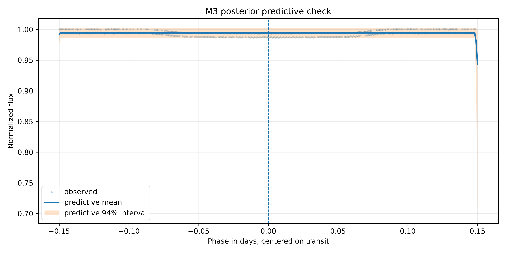
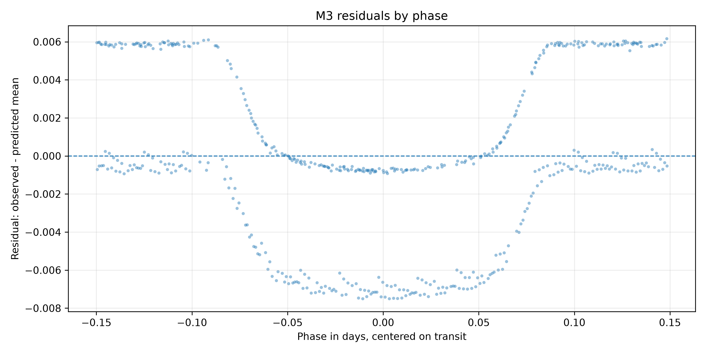
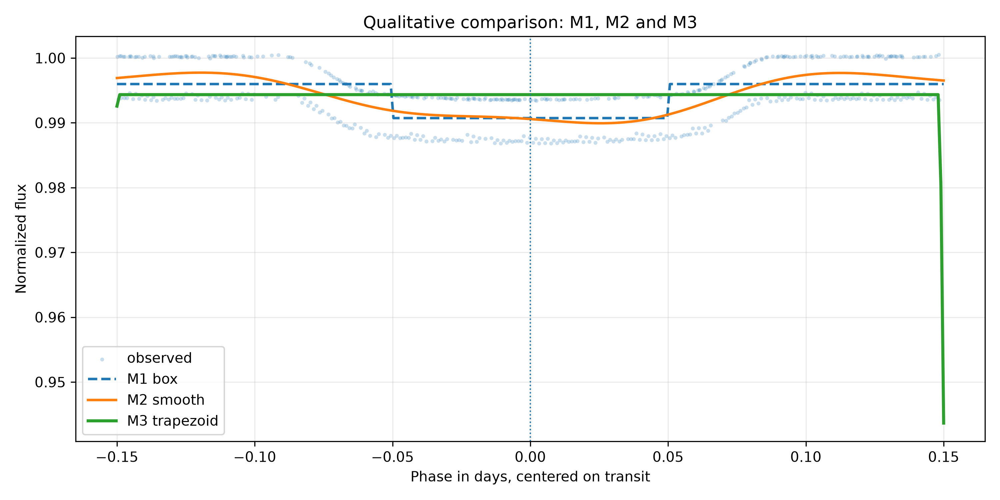

# M3 - Bayesian Trapezoid Transit - HAT-P-7 b

## 1. Objetivo do M3

O M3 aproxima o trânsito de HAT-P-7 b por uma forma trapezoidal bayesiana. O
modelo estima profundidade, centro, duração total aproximada, ingresso/egresso,
baseline e ruído extra.

## 2. Diferença Entre M1, M2 e M3

- M1 estima uma profundidade em uma forma box-shaped fixa.
- M2 estima uma função suave preditiva em fase, sem parâmetros físicos diretos.
- M3 estima uma forma trapezoidal paramétrica, mais interpretável que M2 e mais flexível que M1.

## 3. Dataset Usado

Entrada:

```text
data/gold/hat_p_7_b/modeling/transit_window_lightcurve.csv
```

Dataset efetivo:

```text
tables/bayesian_sensitivity/hat_p_7_b/modeling_input_trapezoid.csv
```

Pontos usados:

```text
516
```

## 4. Pré-processamento

Foram mantidas as regras de M1/M2:

- `abs(phase) <= 0.15`;
- `quality == 0`;
- remoção de `phase`, `flux` ou `flux_err` ausentes;
- remoção de `flux_err <= 0`;
- normalização local pela mediana em `0,08 <= abs(phase) <= 0,15`.

Baseline mediano:

```text
1040715.45
```

## 5. Especificação Trapezoidal

Com `d = abs(phase - center)`:

```text
transit_shape = clip((half_duration - d) / ingress_duration, 0, 1)
mu = baseline - depth * transit_shape
```

Essa forma produz:

- `transit_shape = 1` no fundo plano;
- `0 < transit_shape < 1` no ingresso/egresso;
- `transit_shape = 0` fora do trânsito.

## 6. Priors

```text
baseline ~ Normal(1.0, 0.01)
depth ~ HalfNormal(0.02)
center ~ Normal(0.0, 0.01)
half_duration ~ Uniform(0.03, 0.12)
ingress_fraction ~ Beta(2, 5)
ingress_duration = ingress_fraction * half_duration
extra_sigma ~ HalfNormal(0.005)
```

## 7. Likelihood

```text
sigma_eff_i = sqrt(normalized_flux_err_i^2 + extra_sigma^2)
normalized_flux_i ~ Normal(mu_i, sigma_eff_i)
```

## 8. Resultados Posteriores

Arquivo:

```text
tables/bayesian_sensitivity/hat_p_7_b/posterior_summary.csv
```

Resumo:

| parameter | mean | hdi_3% | hdi_97% | r_hat | ess_bulk | ess_tail |
| --- | --- | --- | --- | --- | --- | --- |
| baseline | 0.99434593 | 0.99398086 | 0.99471407 | 1.00068761 | 5584.00345375 | 5054.4918222 |
| depth | 0.49992671 | 0.48149546 | 0.51901354 | 1.00028594 | 4995.36437931 | 4691.26153954 |
| center | -0.00072502 | -0.18232702 | 0.18081267 | 1.73410951 | 6.10245888 | 36.61578269 |
| half_duration | 0.03057041 | 0.03001753 | 0.03200523 | 1.00080918 | 2775.49947496 | 2956.13000703 |
| ingress_duration | 0.00900287 | 0.00132229 | 0.01956225 | 1.00031605 | 3002.40657046 | 2567.73404593 |
| extra_sigma | 0.00438685 | 0.00413437 | 0.00464825 | 1.00105311 | 5705.0983332 | 5196.36921865 |
| rp_rs | 0.70701982 | 0.69389874 | 0.72042594 | 1.00028991 | 4995.36437931 | 4691.26153954 |

## 9. Parâmetros Derivados

Arquivo:

```text
tables/bayesian_sensitivity/hat_p_7_b/derived_parameters_summary.csv
```

Principais resultados:

```text
depth = 0.49992671, HDI 94% [0.48149546, 0.51901354]
Rp/Rs = 0.70701982, HDI 94% [0.69389874, 0.72042594]
center = -0.00072502, HDI 94% [-0.18232702, 0.18081267]
full_duration = 0.06114082 dias = 1.4674 horas
ingress_duration = 0.00900287 dias = 0.2161 horas
```

## 10. Posterior Predictive Check

Arquivo:

```text
tables/bayesian_sensitivity/hat_p_7_b/posterior_predictive_summary.csv
```

Cobertura aproximada do intervalo preditivo de 94% nos pontos observados:

```text
1.000000
```

Figura:



## 11. Resíduos

Arquivo:

```text
tables/bayesian_sensitivity/hat_p_7_b/residual_summary.csv
```

Métricas:

- média dos resíduos: `-0.00018664`
- mediana dos resíduos: `-0.00050979`
- desvio padrão dos resíduos: `0.00437624`
- desvio padrão dos resíduos padronizados: `0.99756521`

Figura:



## 12. Comparação Qualitativa com M1 e M2

M1 depth robusto:

```text
0.00525258
```

M2:

```text
M2 curve available.
```

Figura:



## 13. Diagnósticos MCMC

- sampler: `NUTS`
- draws: `2000`
- tune: `2000`
- chains: `4`
- target_accept final: `0.99`
- divergências: `11`
- R-hat máximo: `1.73410951`
- ESS mínimo: `6.10245888`
- aceitação média: `0.98410755`
- BFMI mínimo: `0.82819427`
- recomendado para interpretação M3: `False`

Nota:

```text
Review diagnostics before treating M3 as reliable.
```

## 14. Interpretação Astrofísica Preliminar

M3 é mais interpretável que M2 porque estima explicitamente profundidade,
centro e durações aproximadas. Também é mais flexível que M1 por incluir
ingresso e egresso.

## 15. Limitações

M3 ainda:

- não usa limb darkening;
- não usa geometria orbital completa;
- não usa Mandel & Agol;
- assume erros independentes condicionais;
- usa apenas Kepler;
- não é modelo físico final.

## 16. Próximos Passos

O próximo passo é M4: comparação de M1, M2 e M3 por posterior predictive
checks, erro preditivo e, se adequado, LOO/WAIC.
