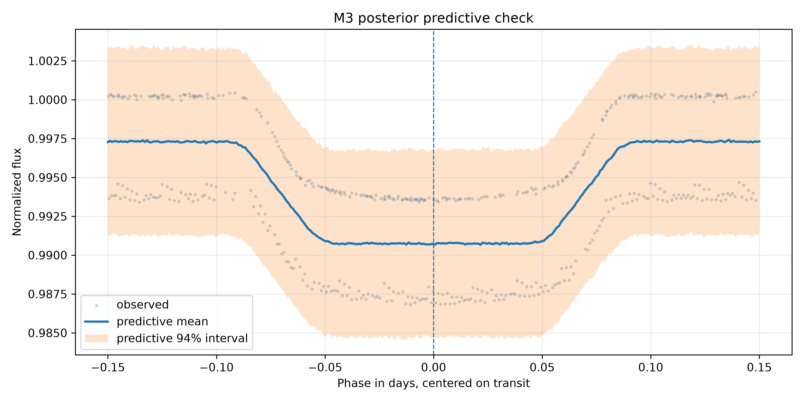
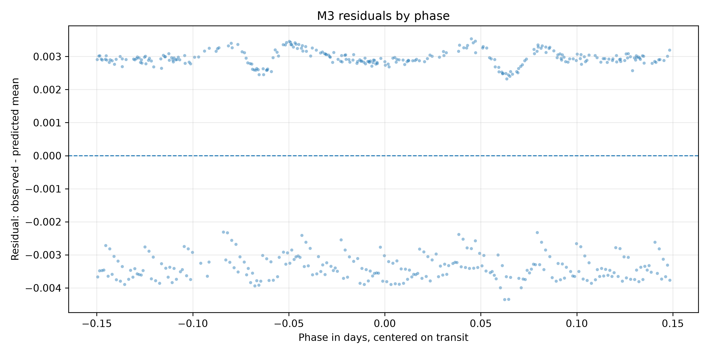
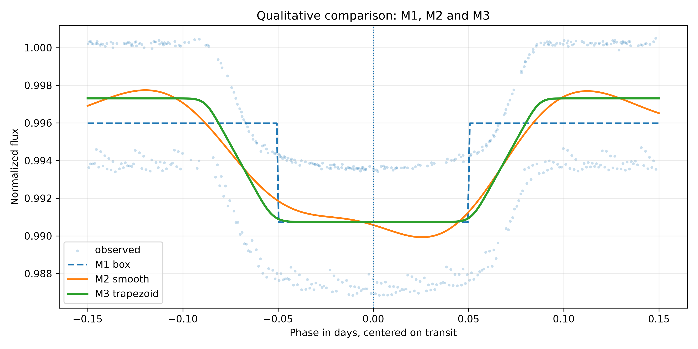

# M3 - Bayesian Trapezoid Transit - HAT-P-7 b

## 1. Objetivo do M3

O M3 aproxima o trânsito de HAT-P-7 b por uma forma trapezoidal bayesiana. O
modelo estima profundidade, centro, duração total aproximada, ingresso/egresso,
baseline e ruído extra.

## 2. Diferença Entre M1, M2 e M3

- M1 estima uma profundidade em uma forma box-shaped fixa.
- M2 estima uma função suave preditiva em fase, sem parâmetros físicos diretos.
- M3 estima uma forma trapezoidal paramétrica, mais interpretável que M2 e mais flexível que M1.

## 3. Dataset Usado

Entrada:

```text
data/gold/hat_p_7_b/modeling/transit_window_lightcurve.csv
```

Dataset efetivo:

```text
tables/bayesian_trapezoid_transit/hat_p_7_b/modeling_input_trapezoid.csv
```

Pontos usados:

```text
516
```

## 4. Pré-processamento

Foram mantidas as regras de M1/M2:

- `abs(phase) <= 0.15`;
- `quality == 0`;
- remoção de `phase`, `flux` ou `flux_err` ausentes;
- remoção de `flux_err <= 0`;
- normalização local pela mediana em `0,08 <= abs(phase) <= 0,15`.

Baseline mediano:

```text
1040715.45
```

## 5. Especificação Trapezoidal

Com `d = abs(phase - center)`:

```text
transit_shape = clip((half_duration - d) / ingress_duration, 0, 1)
mu = baseline - depth * transit_shape
```

Essa forma produz:

- `transit_shape = 1` no fundo plano;
- `0 < transit_shape < 1` no ingresso/egresso;
- `transit_shape = 0` fora do trânsito.

## 6. Priors

```text
baseline ~ Normal(1.0, 0.01)
depth ~ HalfNormal(0.02)
center ~ Normal(0.0, 0.01)
half_duration ~ Uniform(0.03, 0.12)
ingress_fraction ~ Beta(2, 5)
ingress_duration = ingress_fraction * half_duration
extra_sigma ~ HalfNormal(0.005)
```

## 7. Likelihood

```text
sigma_eff_i = sqrt(normalized_flux_err_i^2 + extra_sigma^2)
normalized_flux_i ~ Normal(mu_i, sigma_eff_i)
```

## 8. Resultados Posteriores

Arquivo:

```text
tables/bayesian_trapezoid_transit/hat_p_7_b/posterior_summary.csv
```

Resumo:

| parameter | mean | hdi_3% | hdi_97% | r_hat | ess_bulk | ess_tail |
| --- | --- | --- | --- | --- | --- | --- |
| baseline | 0.99730624 | 0.99690219 | 0.99771396 | 1.00098607 | 5725.46753276 | 5562.56225124 |
| depth | 0.0065662 | 0.00594692 | 0.00716767 | 1.00038945 | 5995.33013887 | 5614.30368942 |
| center | -0.00058156 | -0.00373031 | 0.00260803 | 1.00011232 | 6882.63367449 | 5538.93234534 |
| half_duration | 0.0883237 | 0.08218581 | 0.09584455 | 1.00080861 | 4830.81184246 | 4260.83957835 |
| ingress_duration | 0.03697592 | 0.0254889 | 0.05114678 | 1.00107423 | 4560.39444976 | 4212.34208408 |
| extra_sigma | 0.00319567 | 0.00301355 | 0.00338942 | 1.0000664 | 7350.45288943 | 5260.39266575 |
| rp_rs | 0.08100761 | 0.07711627 | 0.0846621 | 1.00042132 | 5995.33013887 | 5614.30368942 |

## 9. Parâmetros Derivados

Arquivo:

```text
tables/bayesian_trapezoid_transit/hat_p_7_b/derived_parameters_summary.csv
```

Principais resultados:

```text
depth = 0.00656620, HDI 94% [0.00594692, 0.00716767]
Rp/Rs = 0.08100761, HDI 94% [0.07711627, 0.08466210]
center = -0.00058156, HDI 94% [-0.00373031, 0.00260803]
full_duration = 0.17664741 dias = 4.2395 horas
ingress_duration = 0.03697592 dias = 0.8874 horas
```

## 10. Posterior Predictive Check

Arquivo:

```text
tables/bayesian_trapezoid_transit/hat_p_7_b/posterior_predictive_summary.csv
```

Cobertura aproximada do intervalo preditivo de 94% nos pontos observados:

```text
1.000000
```

Figura:



## 11. Resíduos

Arquivo:

```text
tables/bayesian_trapezoid_transit/hat_p_7_b/residual_summary.csv
```

Métricas:

- média dos resíduos: `-0.00000396`
- mediana dos resíduos: `0.00259044`
- desvio padrão dos resíduos: `0.00317806`
- desvio padrão dos resíduos padronizados: `0.99446006`

Figura:



## 12. Comparação Qualitativa com M1 e M2

M1 depth robusto:

```text
0.00525258
```

M2:

```text
M2 curve available.
```

Figura:



## 13. Diagnósticos MCMC

- sampler: `NUTS`
- draws: `2000`
- tune: `2000`
- chains: `4`
- target_accept final: `0.9`
- divergências: `0`
- R-hat máximo: `1.00107423`
- ESS mínimo: `4212.34208408`
- aceitação média: `0.90800918`
- BFMI mínimo: `0.85430120`
- recomendado para interpretação M3: `True`

Nota:

```text
NUTS diagnostics satisfy the project criteria for M3 interpretation.
```

## 14. Interpretação Astrofísica Preliminar

M3 é mais interpretável que M2 porque estima explicitamente profundidade,
centro e durações aproximadas. Também é mais flexível que M1 por incluir
ingresso e egresso.

## 15. Limitações

M3 ainda:

- não usa limb darkening;
- não usa geometria orbital completa;
- não usa Mandel & Agol;
- assume erros independentes condicionais;
- usa apenas Kepler;
- não é modelo físico final.

## 16. Próximos Passos

O próximo passo é M4: comparação de M1, M2 e M3 por posterior predictive
checks, erro preditivo e, se adequado, LOO/WAIC.
