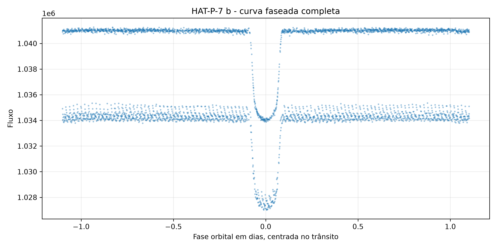
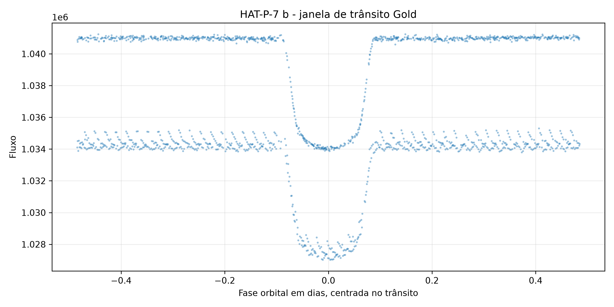
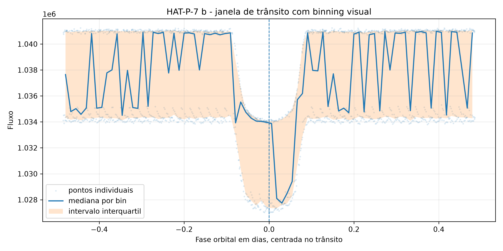
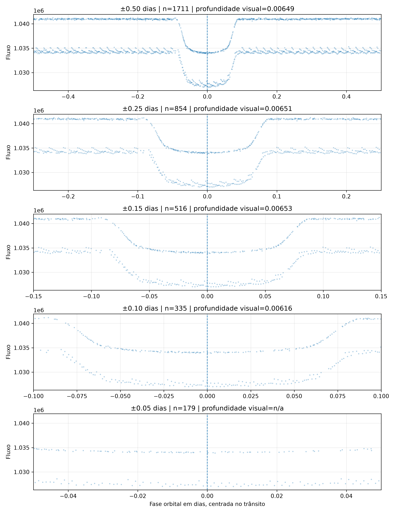

# EDA Gold - HAT-P-7 b

## 1. Objetivo da EDA

Esta etapa realiza uma análise exploratória e diagnóstica da camada Gold de
HAT-P-7 b antes da modelagem bayesiana. O objetivo é verificar se a curva de
luz preparada na Gold é coerente, rastreável e numericamente adequada para uma
primeira modelagem.

Esta EDA **não** realiza inferência bayesiana, ajuste físico de trânsito,
amostragem posterior ou comparação com literatura. As métricas de profundidade
abaixo são aproximações exploratórias por contraste de medianas.

## 2. Arquivos Gold utilizados

- `data/gold/hat_p_7_b/catalogs/reference_parameters.csv`
- `data/gold/hat_p_7_b/lightcurves/primary_lightcurve.csv`
- `data/gold/hat_p_7_b/lightcurves/primary_lightcurve_quality_filtered.csv`
- `data/gold/hat_p_7_b/modeling/phase_folded_lightcurve.csv`
- `data/gold/hat_p_7_b/modeling/transit_window_lightcurve.csv`
- `data/gold/hat_p_7_b/validation/gold_lightcurve_summary.csv`

## 3. Resumo dos dados

| Métrica | Valor |
| --- | --- |
| Planeta | HAT-P-7 b |
| Missão | Kepler |
| Linhas na curva primária | 6163 |
| Linhas após filtro de qualidade | 3909 |
| Linhas na curva faseada | 3909 |
| Linhas na janela Gold atual | 1664 |
| Intervalo de tempo primário | 120.539 a 258.467 |
| Intervalo de fase da janela atual | -0.485083 a 0.484946 dias |
| Fluxo mediano na janela | 1.03487e+06 |
| Desvio padrão do fluxo na janela | 4012.55 |
| `flux_err` mediano | 25.8861 |
| Valores ausentes em `flux` na janela | 0 |
| Valores ausentes em `flux_err` na janela | 0 |

Tabela derivada:

- `tables/gold_eda/hat_p_7_b/gold_eda_summary.csv`

## 4. Qualidade e flags

A curva primária possui `3909` pontos com
`quality == 0` e `2254` pontos com
`quality != 0`. A Gold filtrada por qualidade manteve os pontos com
`quality == 0`, resultando em `3909`
linhas.

Para a modelagem preliminar, a curva filtrada por qualidade é a base mais
adequada, pois reduz pontos explicitamente marcados por flags instrumentais.

## 5. Curva faseada

A curva faseada foi criada na Gold usando o período orbital e o tempo central
de trânsito convertidos para a escala temporal Kepler. A EDA encontrou
`3909` pontos faseados.

Resposta objetiva: **a curva mostra um trânsito visualmente identificável?**

**Sim.** A aproximação exploratória por contraste de medianas na
janela atual é `0.006501` em fração relativa do fluxo fora do
trânsito. Esse valor não é uma estimativa inferencial; ele serve apenas como
diagnóstico visual.

Figura principal:

- `figures/gold_eda/hat_p_7_b/03_phase_folded_lightcurve_full.png`



## 6. Janela de trânsito

A janela Gold atual contém `1664` pontos e
cobre aproximadamente `0.48508` a
`0.48495` dias em torno da fase zero.

A duração de trânsito usada é `0.16176` dias
(`3.8822` horas), com meia duração aproximada de
`0.080878` dias.

Dispersão fora do núcleo do trânsito, calculada apenas como diagnóstico:
`3334.47` unidades de fluxo.

Figuras:

- `figures/gold_eda/hat_p_7_b/01_primary_lightcurve_time.png`
- `figures/gold_eda/hat_p_7_b/02_quality_filtered_lightcurve_time.png`
- `figures/gold_eda/hat_p_7_b/03_phase_folded_lightcurve_full.png`
- `figures/gold_eda/hat_p_7_b/04_transit_window_lightcurve.png`
- `figures/gold_eda/hat_p_7_b/05_transit_window_binned.png`
- `figures/gold_eda/hat_p_7_b/06_flux_distribution.png`
- `figures/gold_eda/hat_p_7_b/07_flux_err_distribution.png`
- `figures/gold_eda/hat_p_7_b/08_window_width_comparison.png`

Visualizações principais da janela de trânsito:





## 7. Diagnóstico sobre a largura da janela atual

Resposta objetiva: **a janela atual de ±0.48527 dias parece excessivamente larga?**

**Sim.** Ela é útil para inspeção ampla, mas inclui muito
baseline fora do trânsito em comparação com a duração do evento. Para uma
primeira modelagem bayesiana, uma janela mais estreita tende a reduzir
estrutura de longo prazo e manter o foco no evento de trânsito.

Comparação de janelas:

| window_half_width_days | row_count | flux_median | flux_std | approximate_depth_visual | in_transit_count | out_of_transit_count | notes |
| --- | --- | --- | --- | --- | --- | --- | --- |
| 0.5 | 1711 | 1.03489e+06 | 3996.92 | 0.0064917 | 287 | 1424 | exploratory median contrast only; not a fitted or Bayesian estimate |
| 0.25 | 854 | 1.03452e+06 | 4378.04 | 0.00650769 | 287 | 567 | exploratory median contrast only; not a fitted or Bayesian estimate |
| 0.15 | 516 | 1.0343e+06 | 4554.2 | 0.0065348 | 287 | 229 | exploratory median contrast only; not a fitted or Bayesian estimate |
| 0.1 | 335 | 1.03406e+06 | 4155.09 | 0.00616478 | 287 | 48 | exploratory median contrast only; not a fitted or Bayesian estimate |
| 0.05 | 179 | 1.03395e+06 | 3322.22 |  | 179 | 0 | window has no usable in-transit or out-of-transit baseline |


Tabela derivada:

- `tables/gold_eda/hat_p_7_b/window_comparison_summary.csv`



## 8. Sugestão preliminar de janela para modelagem

Resposta objetiva: **há dados suficientes em uma janela mais estreita?**

Sim. A comparação indica que existem pontos suficientes em janelas menores que
a Gold atual. Como critério preliminar, a janela recomendada para o primeiro
teste de modelagem é:

**±0.15 dias em torno da fase zero.**

Essa recomendação mantém o trânsito e uma região curta de baseline local. Ela
deve ser reavaliada junto com resíduos, normalização local e comportamento da
likelihood no modelo bayesiano.

## 9. Limitações

- A profundidade visual é uma aproximação por contraste de medianas, não uma
  estimativa física nem inferencial.
- Nenhuma normalização adicional foi aplicada nesta EDA.
- Nenhum outlier foi removido nesta etapa.
- A análise usa a curva Gold já filtrada por qualidade para fase e janela.
- A escala temporal já foi tratada na Gold; esta etapa apenas diagnostica o
  resultado preparado.
- O diagnóstico visual não substitui validação posterior do modelo e dos
  resíduos.

Warnings:

- Nenhum warning crítico registrado.

## 10. Próximos passos

Resposta objetiva: **há `flux_err` utilizável para likelihood gaussiana?**

**Sim.** A coluna `flux_err` está presente na janela Gold e
tem mediana `25.8861`. Ela é numericamente utilizável
para uma likelihood gaussiana preliminar, desde que a próxima etapa avalie a
escala do ruído e a adequação dos resíduos.

Resposta objetiva: **a Gold parece pronta para um modelo bayesiano preliminar?**

Sim, com cautela. A Gold está pronta para um modelo preliminar simples, desde
que a modelagem documente a escolha de janela, trate normalização local de forma
explícita e não interprete esta EDA como resultado inferencial.

Resposta objetiva: **qual arquivo deve ser usado na próxima etapa?**

Use como entrada principal:

`data/gold/hat_p_7_b/modeling/transit_window_lightcurve.csv`

Para o primeiro modelo, aplicar no script de modelagem um filtro preliminar:

```python
abs(phase) <= 0.15
```

O arquivo Gold não foi alterado nesta EDA.
